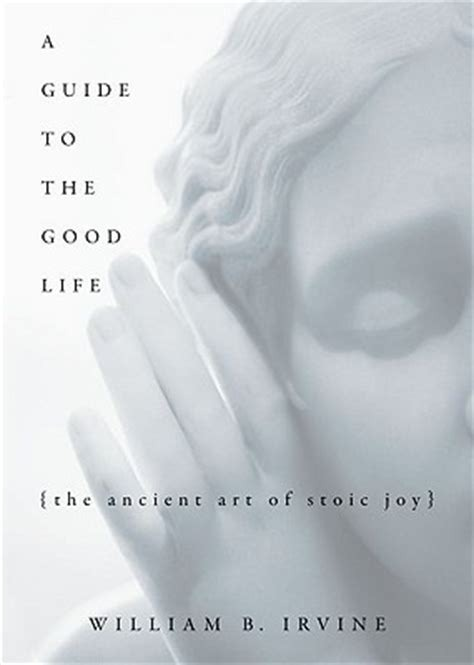

# A Guide To The Good Life {The Ancient Art of Stoic Joy} - William B. Irvine

## The Book In 3 Sentences
The Stoic Philosophy was originally founded in Greece by Zeno, however, was later popularized in Rome by Epictetus, Marcus Aurelius and Seneca and like any philosophy it delineates a path to happiness, in particular, the acquisition and maintenance of tranquility. Stoic psychological practices include negative visualization, understanding and applying the trichotomy of control, fatalism of the past and present but not of the future, self denial and meditation. Stoicism is a practical philosophy and the advice advocated can be applied in all facets of life including dealing with anger, fame, wealth, old age and death. 

## My 411
In my opinion, this book is the best introduction of Stoicism as it distills and modernizes the true essence of the philosophy in an incredibly simple yet complete way for the modern seeker. The book is filled with not only the most important precepts of the philosophy but also practical and apt examples of the application. The flow of the book is impeccable; I was afraid the book would read like an convoluted philosophical research paper, however, within a couple of pages of reading, my apprehension was allayed by the colloquial language used and lucid structure of the material. 

The book is divided into four main parts. The first and fourth part go over the history of Stoicism and Stoicism in the modern world respectively. While the second and third parts revolve around the psychological tactics employed by stoics and their application in various circumstances one would ordinarily face in life. 

Stoicism was founded by Zeno of Citium in Greece as a departure from Cynicism that was considered impractical and too extreme although there were some teachings from Cynicism that could be salvaged and transmogrified into more practical ones. Passed on the Romans from the Greeks, Stoicism was taught in different schools typically on the front porch of the schools where the philosophy gets its name from: `stoa` meant a porch or a covered area where discourses were held. 

The premise of Stoicism is to lead a happy life by attaining and maintaining a state of tranquility and not letting anything disrupt that state. The method of attaining tranquility is by living in accordance with nature by utilizing our facility of reason to live a life of virtue. The psychological tactics employed to lead and keep us in a state of tranquility can be summarized as:

1. _Negative Visualization_: By imagining the worst case scenario, we are mentally better prepared in the case the said scenarios were to actually transpire. Also, by visualizing loss, we value what we have more than what we don't have. 

2. _Trichotomy of Control_: We shouldn't waste time getting anxious about things outside our control as it will always be a fruitless endeavor. We should concentrate our efforts on things that are completely and somewhat under our control. For things that are partially under our control, we should create _internal_ rather than external goals.

3. _Fatalism_: We should adopt a fatalist attitude about the past and present but not of the future. A fatalist attitude inculcates an attitude of submission to relinquish control to fate thereby not getting stuck in the past nor in the present moment.

4. _Self Denial_: By depriving ourselves of things we take for granted, we start to value what we own a lot more.

5. _Meditation_: By reflecting on our performance as Stoics, we are more likely to look at our mistakes and rectify them under the self-analytical microscope. 

After describing the psychological tactics, the author dived into their application. The two applications that I found most intriguing were the use of humor, in particular self-deprecating humor, when someone insults you or makes you angry as a means of maintenance of tranquility and viewing old age as the fertile ground to test the stoic idea of maximizing happiness out of the remnants of life remaining as the grim reaper approaches near. 

One of my favorite parts of the book was how the author described his adapted view of Stoicism for the modern atheistic practitioner. The Roman Stoics believed that Zeus created man who, unlike other animals, was imbued with the power of reasoning. Taking a more evolutionary route for the need of Stoicism, the author promulgates that it is this power of reasoning that initially helped us survive and propagate our species is now the cause of anxiety and insatiability. Anxiety can be conquered by reason and the application of the trichotomy of control and insatiability can be conquered via self denial amongst the other aforementioned psychological techniques.

I personally believe it is through the practice of Stoicism, one can get farther away from Existential Nihilism and get closer to the state of what Friedrich Nietzsche called the ``Ubermenchen`` or the Super Man who is an evolved form of man impervious to any obstacle. The author ends by outlining a very doable plan to start slowly incorporating Stoicism in one's life that I plan to start working on. I highly recommend this book to anyone with even an iota of interest in philosophy as it truly has opened my eyes.