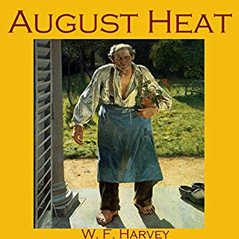

# August Heat - W. F. Harvey

## The Book In 3 Sentences

"August Heat" is a 1910 short story by W. F. Harvey, about two men, unknown to each other, whose look at the other's possible future suggests that one of them will be murdered and the other will be the murderer.

## My 411