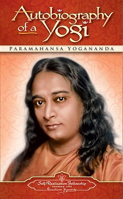

# Autobiography of a Yogi - Parmahansa Yogananda

Finished my annual read of Autobiography of a Yogi by Paramhansa Yogananda. Been reading this book almost every year (sometimes multiple times) in the winter since 2011. This book never fails to leave me in awe and forces me to meditate more.

## The Book in 3 Sentences
The author expounds his life experiences involving his penchant desire to lead a life of solitude in the Himalayas as a kid, meeting multiple saints who performed unexplained miracles, years under his teacher's tutelage, his journey to establish a Yoga center in India and eventually here, in the States. The importance of simple living and the concomitant practice of meditation is brought up as a way to achieve salvation from mundane existence. The most profound of his relationships has been with his teacher and he has elucidated on these experiences in meticulous detail.