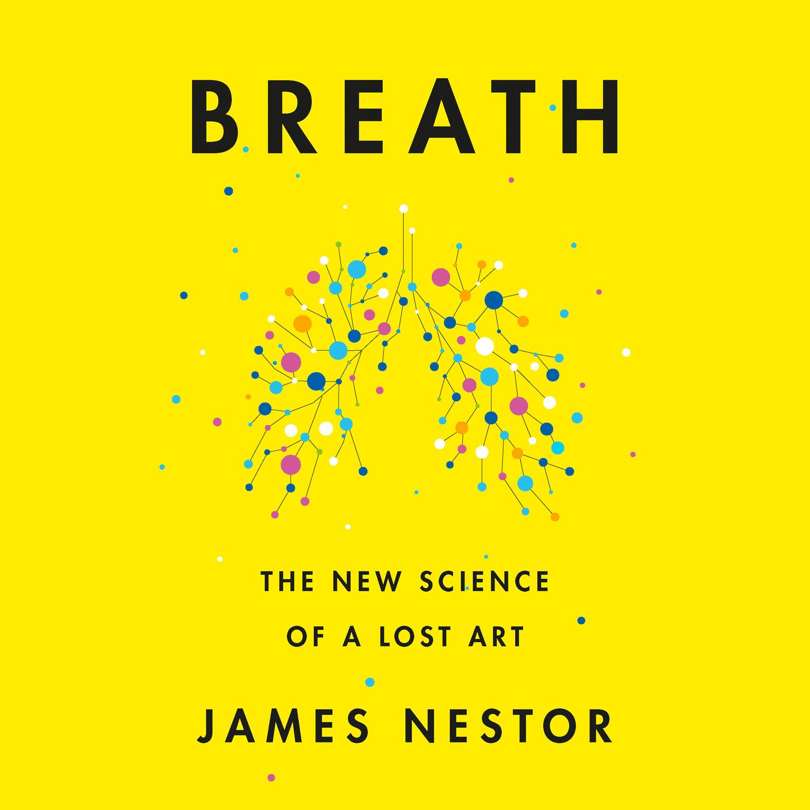

# Breath - James Nestor

## The Book In 3 Sentences
Breathing correctly is of paramount importance and is a fundamental pillar of health - no matter what we eat, how much we exercise, how resilient our genes are, how skinny or young or wise we are — none of it will matter unless we’re breathing correctly. Breathe through your nose and never from your mouth, breathe less and slowly, exhale to expel the residual oxygen and chew more by consuming more raw foods (less processed) to develop your facial muscles to breathe better. Good oral posture, training to breathe more on occasion such as in the Wim Hoff Method and holding your breath are more ways to improve your breathing; the perfect breath should be 5.5 seconds spent inhaling, 5.5 seconds holding and 5.5 seconds+ spent exhaling - emphasis should be to exhale longer than inhaling to build CO2 tolerance.

## My 411
One of the best books I have read this year, Breath by James Nestor was an eye-opening read in the world of Pulmonauts or breath hackers (read Modern day Yogis). A first-class recommendation by Brian Johnson, Breath amalgamated anecdotal experiences namely, Nestor' s experiments and experiences with breath hacking, with scientifically proven facts in an extremely engaging way. Needless to say, as a novice Pulmonaut, I was hooked to this book from the get-go.

The book is divided into three parts: The Experiment, The Lost Art And Science of Breathing and Breathing+. The Experiment dived into an outlandish experiment conducted by Nestor to prove the insalubrious effects of mouth breathing by plugging up his nose surgically for 20 days and noting the effects. The Lost Art And Science of Breathing expounded on the fall from grace from a healthier time due to modernity and how to gain our health back by following simple yet efficacious techniques to improve our breathing. Breathing+ goes into advanced breathing techniques such as the Win Hoff Method and Tummo and tries to marry ancient techniques with modern day scientific explanations.

The commonality I have observed in these health-advocacy books is that historically, the contrarians who opposed the conventional beliefs and stuck to their guns guided primarily through the scientific method are usually right and unfortunately vilified; this made me ponder over the intentions of those who dictate "what we should all believe" and how much their recommendations are influenced by fattening their wallets vs. helping others. A clear example of this is the widely accepted notion that CO2 is a toxic byproduct that has no use for us. Paradoxically, CO2 is needed to get oxygen molecules out of our haemoglobin to all the tissues in our body.

Some of my favorite parts of the book were the lucid explanations of the scientific facts.Two of my favorites were:
1. Carbon Dioxide is like a divorce lawyer that forces oxygen to get out of haemoglobin into all our body parts.
2. Prana or Life Force is believed to be the excitation of electrons (similarities to the teachings of Parmahansa Yogananda are incredibly noticeable) because of oxygenation.

Congruence of modern scientific research and yogic techniques of the past is enough to pick this book up! I highly recommend this book and will be rereading this well researched eye-opening read.

## Notes

1. __Worst Breathers In The Animal Kingdom__
   1. From an evolutionary perspective, our brains have become bigger, as a result of eat less raw food, taking away space for our mouth and nose and therefore, obstructing our breathing.
   2. Bad breathing has caused a litany of issues including sleep apnea, asthma, crooked teeth and even cancer.
2. __Why Mouth Breathing Is Bad?__
   1. Mouth breathing is not as efficient breathing from the nose.
   2. Our bodies are optimized to breath from our nose - breathing from your mouth leads to over breathing.
   3. I have started to put a Charlie Chaplin moustache sized length of surgical tape to put vertically on my lips before I sleep.
3. __Why Is Over Breathing A Problem And The Importance of CO2__ 
   1. It's not that we get enough oxygen - a healthy body has enough oxygen. It's CO2 that needs to be optimized
   2. We have ~25 trillion red blood cells. 270 million haemoglobin within each red blood cells. Within each haemoglobin, there is space for 4 oxygen molecules.
   3. Issue is: is the oxygen getting out of the haemoglobin to different parts of our body?
   4. Paradoxically, we get more O2 by breathing less and get our CO2 levels higher.
   5. If you are breathing too much, you have enough oxygen in your body but it's not getting out of our body.
   6. Build tolerance of CO2.
4. __We Should Be Chewing More__
   1. Modernity has led to softer, more processed food that has inevitably caused us to chew less and therefore, our facial muscles needed to breath better haven't developed.
5. __The Perfect Breath__
   1. 5.5s Inhale, 5.5s hold, 5.5+s exhale. 
6. __Oral Posture__
   1. J-Shaped not an S-Shaped
      1. Be like a greek statue.
      2. Curve to your spine.
   2. Hunching - lose power.
7. __Advanced Techniques__
   1. Nadi Shodhana
   2. Buteyko Breathing
   3. Tummo
   4. Sudarshan Kriya 