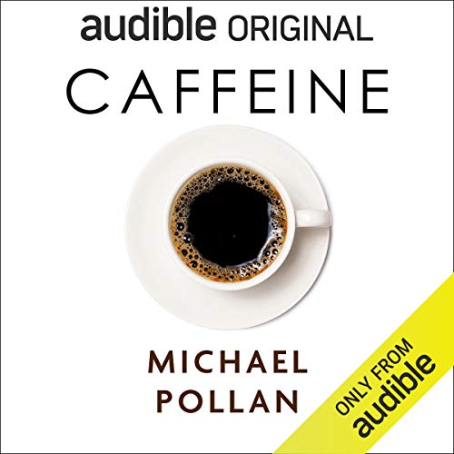

# Caffeine: How Caffeine Created the Modern World - Michael Pollan

## The Book In 3 Sentences
Caffeine, a psychoactive drug, has significantly contributed to the creation of the modern world by changing our collective baseline consciousness and breaking our dependence on circadian rhythm to work harder and with more focus. Caffeine via coffee and tea has had a tumultuously history from discovery in East Africa to winning and losing wars, changing politics, dominating economies and eventually a staple in everyone's diet. Caffeine is a mostly good drug that has health benefits however, it does affect our sleep and therefore, making sure to take an occasional break from caffeine so as to catch up on sleep is important. 

## My 411
Michael Pollan is an unbelievably great story teller and this book exemplifies this extremely well. Pollan took it upon himself to prove that caffeine, a substance we consume on a daily basis is indeed an extremely strong psychoactive substance that deserves a bit more understanding from the addict; to prove his point, he didn't consume caffeine in any form for 3 months and this book documents his journey through this masochistic experiment. Interwoven within his experience of a lack of caffeine, Pollan dove deep into the history of caffeine, how caffeine changed our baseline consciousness, the health benefits and the negatives of consuming caffeine.

My favorite part about the book was Pollan's writing style that consisted of an amalgam of recounting personal experiences and facts he discovered through extensive research on the topic. Humor was another aspect of the book I thoroughly enjoyed - there were parts of the book that made me laugh out loud and others that made me chuckle even though a large chunk of the book involved presenting historical facts.

As a direct consequence of reading the book and absorbing the material, I will be cutting down my intake of coffee by constraining the consumption to just the weekend (have failed to do so far but still have hope..).

## Notes
1. Caffeine has altered our baseline consciousness.
2. __Honeybee experiment__: Despite being devoid of pollen, bees would still gravitate towards caffeinated plants.
3. History of Coffee
   1. 1600s discovery. 
   2. Coffeehouses - french revolution
4. Breaking Circadian Rhythm
5. Slavery played a big part.
6. British East India - China + Hong Kong
   1. Opium and tea.
7. How Coffee Works - Free Lunch? Adenosine blocker.
8. Sleep deprivation - quarter life of caffeine is 12 hours.