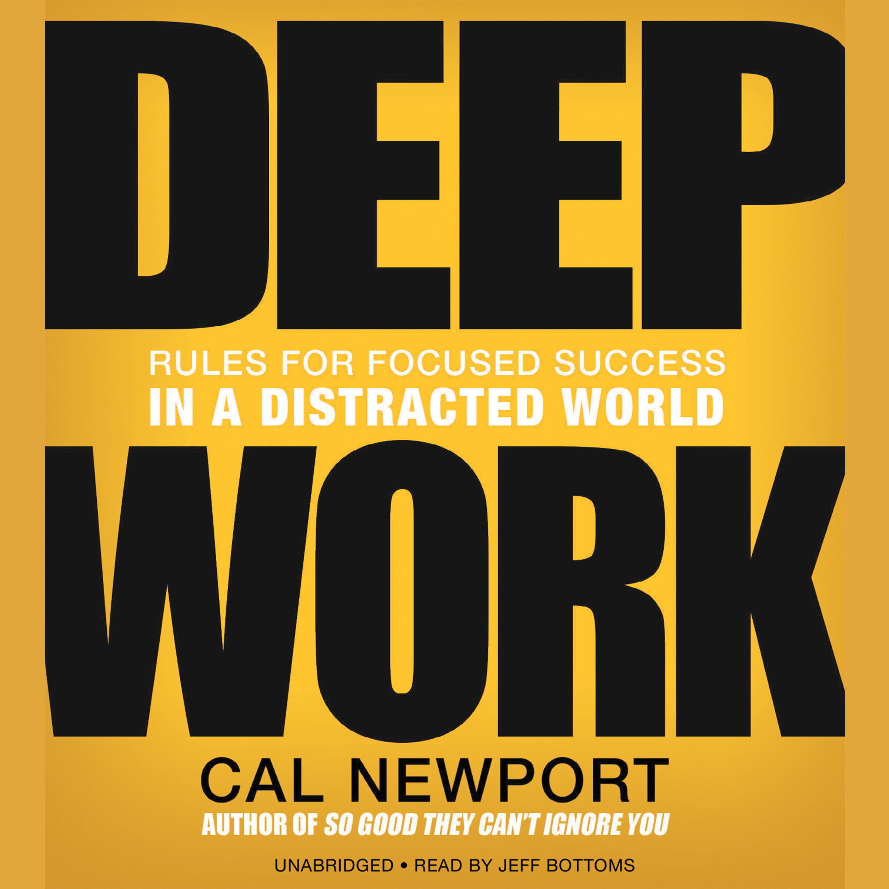

# Deep Work

## The Book In 3 Sentences
Deep work is defined as professional activities performed in a state of distraction-free concentration to push your cognitive boundaries to their limit and is valuable, rare and meaningful in this new post-industrial economy. In distinction to deep work, shallow work is non-cognitively demanding, logistical style "busy" work that is performed typically when you are distracted and doesn't create value. Work deeply, embrace boredom, quit social media and drain the shallows or reduce and control the amount of shallow work you do.

## My 411
This book was nothing short of mind-blowing in its effectiveness to get the message: "Deep work is important and therefore, work deeply and get rewarded" across in this social-media dominated distraction filled world. 

The concision with which the author enumerates each of the problematic situations or pitfalls one would face while trying to do deep work and subsequently providing their algorithmic solution is truly the "secret sauce" of this book. I don't think I have read or listened to a book prior to this one where I have received all the answers to questions that arise with such pertinent specificity.

I would consider this book the algorithmic specialization of Stillness is Key by Ryan Holiday and declare this as a MUST read for anyone wanting to get better at their craft.

## Notes
Deep Work is split into two parts - the why and the how: 

### The "Why"
__The Deep Work Hypothesis__: The ability to perform deep work is becoming increasingly rare and valuable in this post-industrial "knowledge economy" where 3 types of people thrive:
1. Those who can work with intelligent machines
2. Superstars in their respective fields of work 
3. Individuals with excessive amount of capital to invest

Deep works help with 1. and 2. to:
1. Quickly master hard things 
2. Produce at an elite level. 

Furthermore, deep work is meaningful and makes life worth living as real value is generated as a result of inculcating deep work to your routine over time.

The law to quantify productivity that affirms the Deep Work Hypothesis is ``The New Law of Productivity``: High Quality Work Produced = Time Spent x Intensity of Focus. 

Why shallow work is pervasive in our work is due to two main principles:
``The Principle of Least Resistance``: In a business setting, without clear feedback on the impact of various behaviors to the bottom line, we will tend toward behaviors that are easiest in the moment. 
``Busyness as Proxy for Productivity``: In the absence of clear indicators of what it means to be productive and valuable in their jobs, many knowledge workers turn back toward an industrial indicator of productivity: doing lots of stuff in a visible manner.

### The How 

In my opinion, this is part is "cream of the crop" of the book. There are 4 main "hows" where the first how dives into the actual execution of deep work and the remaining three are how to rewire your brain to facilitate sustainable deep work.

1. Work Deeply
   1. Routines
      1. Routines reduce will power, a limited resource that gets spent easily. Routines ease the transition to do deep work without needing will power.
      2. Committing to work-blocks to only do deep work with no distractions is what routines are about.
      3. There are 4 main types of routines that you can choose from to do deep work:
         1. __Monastic__: Isolate yourself for long periods of time without distractions; no shallow work allowed.
         2. __Bimodal__: Reserve a few consecutive days when you will be working like a monastic
            1. you need at least one day a week.
         3. __Rhythmic__: Take 3-4 hours every day to perform deep work on your project. 
            1. The Jerry Seinfeld method where you "don't break the chain".
         4. __Journalistic__: Alternate your day between deep and shallow work as it fits your blocks of time 
            1. Not recommended to try out first as it's the most complicated and requires the most concentration to context switch.
   2. Rituals and Intentions
      1. When you decide to do Deep Work decide:
         1. __Where__ you'll work.
         2. __How long__ you will work for.
         3. __How__ you'll support your work.
            1. For example: Drink coffee before, light exercising halfway through etc.
      2. Set intentions before you start i.e. have a plan.
      3. Have a shutdown ritual
         1. Stop work at the same time.
         2. Don't think about work after the "shutdown" time.
         3. Plan out the remaining tasks _before_ the shutdown.
   3. Make Grand Gestures
       1. Examples of Grand Gestures include J. K. Rowling checking into a fancy hotel to finish the Deathly Hallows. 
       2. Psychology of committing to a task in hand by changing the environment you are in.
       3. Grand Gestures boost the priority of work that helps unlock the mental resources required.
   4. Don't Work Alone
      1. Hub and Spoke model where individuals should be allowed time and space for working deeply AND working collaboratively.
      2. The Whiteboard effect induced by working with others forces one to think deeply quickly. 
   5. Execute like a Business
      1. Follow 4DX:
         1. __Focus on the Wildly Important__: identify a small number of ambitious outcomes to pursue with your deep work hours.
         2. __Act on the Lead Measures__: time spent in a state of deep work dedicated toward your wildly important goal.
         3. __Keep a Compelling Scoreboard__: track the hours spent in deep work that week with a simple tally of tick marks in that week’s row.
         4. __Create a Cadence of Accountability__: use weekly reviews to celebrate good weeks, understand what led to bad weeks, and figure out how to ensure a good score for the days ahead.
2. Embrace Boredom
   1. __Attention Residue__: When you switch from one task to another, some of your attention remains stuck with the original activity. This residue has a negative impact on subsequent performance. Attention Residue hinders deep work.
   2. Don’t take breaks from distraction but instead take breaks from focus:
      1. __Schedule in advance__ when you’ll use the Internet, and then avoid it altogether outside these times. Do it both at home and work to further improve your concentration training.
      2. __Practice productive meditation__: This a period in which you’re occupied physically but not mentally—walking, jogging, driving, showering—and focus your attention on a single well-defined professional problem.
   3. Downtime from deep work aids more deep work.
3. Quit Social Media
   1. Social Media fragment our time and are distracting and as a result, they hinder deep work. 
   2. If you service low-impact activities, like Social Media, you’re taking away time you could be spending on higher-impact activities.
   3. ``The Craftsman Approach to Tool Selection``: identify the core factors that determine success and happiness in your professional and personal life. Adopt a tool only if its positive impacts on these factors substantially outweigh its negative impacts.
4. Drain The Shallows
   1. Reduce the shallow work by acknowledging and planning for it.
   2. Schedule every minute of your day.
   3. Quantify the depth of all your activities: The notebook technique
   4. Work with your boss to plan your shallow work.
   5. Become Hard To Reach with Email