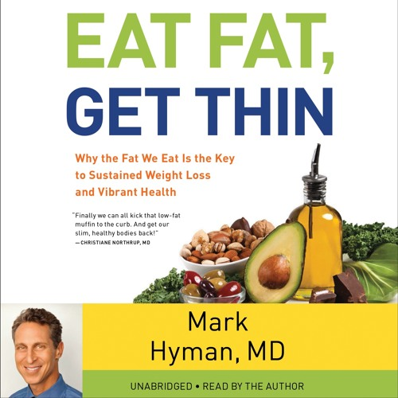

# Eat Fat, Get Thin - Mark Hyman

## The Book In 3 Sentences
A calorie might be equivalent to a calorie in a vacuum in a lab however, in our bodies the foods we eat trigger different metabolic responses some of which can store fat. Fat has been vilified (promotion of low fat diets and demonization of fat in diet, particularly saturated fats) as the primary cause of 'diabeticity' or the host of metabolic conditions consisting of diabetes, obesity, hypertension and sometimes cancer and this vilification through research has been scientifically debunked; the real perpetrators are sugar and refined carbs that cause us to get fat rather than good fats. Eating the right fats and reducing refined carbs and sugar intake are the secrets to preventing chronic disease and longevity and these right fats consist of extra virgin olive oil or "liquid gold", extra virgin coconut oil, MCT oil, avocados, grass-fed butter, ghee, nuts and seeds while the bad fats consist of trans-fats, partially hydrogenated oils, refined vegetable oils e.g. soybean oil and margarine.

## My 411
An INCREDIBLE recommendation by Brian Johnson via his Top 3 Philosopher Notes on Weight Loss, "Eat Fat, Get Thin" is filled to the brim with scientific research about why good fat is good for us and despite all the marketing and literature out there IS the way to losing weight and staying thin. Despite the scientific rigor of the material covered in the book, the message in each of the 4 sections is explained extremely simply. This book is one of the few ones that I have read that not only go into the "why" but also the "how" with crystal clear clarity and a highly specific plan.  

The book is divided into 4 main parts where the first 2 parts go into the "why" consuming good fats make you thin and the latter 2 expound on the "how" of introducing good fats in your diet by delineating a 21 day reboot called the "Eat Fat, Get Thin Plan" that's supposed to "factory reset" your inner garden or gut flora. 

My favorite part of the book was how the author, using scientific research and historical accounts, exposed members of the sugar and high-carb industries that have led a campaign to blame fat for all the problems they have caused. Examples of their influence include funding research studies and extreme lobbying that leads to the government creating policies that protect the sugar industry.

Overall, this incredibly practical book is definitely a must-read for anyone interested in improving their health. My regret is that I had found this book too late and I wish I had discovered it before I started my weight loss journey as it would have made it easier. 

## Notes

### Main Ideas
1. __A Calorie != A Calorie__
2. __Fat is A Communication Mechanism and Food is Information__
3. __Carbs and Sugar are Bad And Make You Hungrier While Good Fats Make You Full__
4. __Dietary Fat != Fat in Blood - Carbs Cause Fats and Cholesterol in Blood__
5. __Good Oils are EVO and Coconut Oil and Bad Fats are any refined seed / Vegetable Oils__ 
6. __PEGAN Diet__

#### All Notes
1. The more "right" fat you eat, the more fat you lose and the better your body functions.
   1. No evidence has been found that links saturated fat, dietary fat or cholesterol and heart disease.
   2. "Good" vegetable oils (soy, sunflower, corn, safflower) are harmful and lead to inflammation and cause heart disease.
2. __Diabeticity__: Carb intolerance
   1.  Refined carbs and sugar causes obesity, heart disease, diabetes amongst some of the metabolic conditions.
   2. Carbs turn on the metabolic switch causing a spike in insulin.
3. __American Paradox__: How Americans eat less fat and yet get fatter vs. __French Paradox__: How French eat more fat and remain thin.
4. Food is not just calories but __information__ that radically influences our genes, hormones, immune system, brain chemistry, and even gut flora with every bite.
5. __Science For Sale__: Vilification of Fat and the Low Fat Fad.
   1. Big Food and Agro funded research that demonized fat.
   2. Government supported sugar and demonization of fat till very recently.
   3. Support of the industry continues because of $$$.
   4. Cardboard tasting food + sugar = Tasty and addictive.
6. __Debunking the Energy Balance Hypothesis__
   1. A calorie is a calorie in a vacuum but not in the human body where multitudes of processes take place to metabolize calories based on the type of calorie.
   2. A calorie of carbs shifts your body into fat storage (anabolism) while a calorie of fats shifts your body into burning calories (catabolism). 
   3. The __Hormonal / Metabolic Hypothesis__ is correct and it promulgates the notion that the composition of and quality of food you eat determines whether or not you lose weight vs. the number of calories.
   4. Obesity was caused by the hormonal effects of carbs and could b treated by restriction of carbs, without worrying about fats and proteins.
7. __Eating Saturated Fat Doesn't Cause Heart Disease however, Hydrogenated fat aka trans fat _does_ lead to heart disease__
8. High Fructose Corn Syrup and Sugar triggers fat production and storage in the liver via _lipogenesis_.
9. Fat makes food tastes better!
10. __Why We Overeat__
    1.  Being fat makes you eat more and exercise less.
    2.  Your fat cells are always hungry.
        1.  If you are fat, your brain chemistry makes you hungry and tired.
    3.  __Solution__: Rather than focus on calories, focus on quality and composition of diet (high fat and protein) to allow the body's natural intelligence to regulate hunger, activity, metabolism and weight.
    4.  "Eat less, exercise more" sends us into starvation mode and isn't sustainable.
        1.  High Protein - Low Carb diets are good for maintenance.
        2.  High Fat - Low Carb diets are good for weight loss _and_ maintenance.
    5.  Spike in insulin causes blood sugar to drop and that drives most of the available fuel in your bloodstream into fat cells, especially around your belly. 
        1.  Simulates your body is starved of fuel and the brain is stimulated to eat more.
11. __Biology of Fat Cells__
    1.  Fat cells are actually __endocrine__ cells that produce hormones => communicate with other parts of your body.
    2.  Fat tissue is part of the immune system. 
    3.  Fat cells store energy and these cells produce even more fat when they detect carbs in your blood stream.
    4.  The communication mechanism of fat cells is controlled by the quality and type of food you eat.
    5.  In other words, body fat is complex metabolic tissue that is critical in regulating your appetite, controlling the rate of calorie burning and regulating weight.
12. __Eating a Low Fat Diet Makes You Crave Bad Foods__
    1.  Higher carbs make you crave even more carbs as your brain is tricked into thinking you are always hungry.
    2. Nutrient dense foods are satisfying while processed foods are less satiating => you get hungrier after eating them.
    3. When you eat less carbs, you burn up glycogen => lose water. 
13. __The Skinny On Fat__
    1.  Saturated fat is bad when eaten with carbs.
    2.  Imbalances causes all the metabolic issues.
    3.  Biggest determinant of our health is the food we eat.
        1.  Real, whole, fresh, unmodified foods must be a starting point.
    4.  Fat = Fatty Acids that are a chain of carbon, hydrogen and oxygen with a carboxyl group.
        1.  Double bond between C's => polyunsaturated.
        2.  Chains of 3 C's => Triglyceride
    5.  If glucose isn't available, fatty acids are used for energy.
        1.  Burning fatty acids are better for your health - it's what your muscles and heart prefer.
        2.  Ketones are produced from fat.
    6.  4 Types of Fatty Acids:
        1.  Saturated
            1.  0 double bonds => it is saturated with hydrogen.
            2. Good Saturated fats have odd # of chains vs. even number.
            3. Dietary saturated fat doesn't raise blood saturated fat.
            4. Saturated fats cause inflammation only if they are eaten with sugar or refined carbs / you don't eat omega-3s
            5. Brain is made up of Saturated Fat + Omega 3s
            6. Examples:
               1. Palm oil, coconut oil, grain fed dairy. 
        2.  Monounsaturated 
            1.  One double bond.
            2.  Monounsaturated fats are mostly good for you!
            3.  Process of creating monounsaturated fats can make them bad.
                1.  Canola oil that's highly processed can be bad.
            4.  Examples:
                1.  Olive oil, avocados and almonds
        3.  Polyunsaturated
            1.  Many double bonds.
            2.  2 types: Omega 3s and Omega 6s.
            3.  Essential for living.
            4.  RATIO of Omega 6s to Omega 3s matters. Omega 6s aren't all bad.
                1.  Unfortunately, our diet has evolved so that Omega 6s is >> than Omega 3s.
            5.  Omega 3s = super important and fight depression better than some medicines.
        4.  Transfats
            1.  Double bonds on opposite side of fat chain (trans).
            2.  Hydrogen is added to fatty acids to increase shelf life.
            3.  Cause heart disease and diabetes.
            4.  Examples:
                1.  Margarine
14. Research Findings
    1.  Total fat and saturated fats doesn't cause heart disease
    2.  Omega 3s help with heart disease while transfat cause it.
    3.  Consume saturated fat with fiber and no refined carbs or sugar.
    4.  Saturated fat in your blood that cause heart disease comes from sugar and refined carbs that's metabolized into fat in the liver.
    5.  Saturated fat sources such as butter reduce heart disease.
    6.  Omega-6 fats from refined vegetable oils show no benefit of heart disease and can even cause them.
    7.  Omega-6 fats from eggs seem to be protective.
    8.  Omega 3s and fiber make saturated fat prevent heart disease.
    9.  Small and dense LDL cholesterol is bad and leads to heart disease and this is a result of carbs, sugar and an imbalance of Omega-6s vs. Omega-3s.
    10. Dietary cholesterol doesn't lead to cholesterol in the blood.
    11. Inflammation caused by Omega-6 rich vegetable oils can oxidized small LDL cholesterol and causes more issues.
    12. Statins don't always work and have harmful side effects.
    13. Lifestyle changes reduce heart disease significantly.
15. __Vegetable Oils__
    1.  High Omega-6s and Low Omega-3s in refined vegetable oil (particularly, soy bean oil) cause heart disease as refined omega-6s go rancid + oxidize easily causing hard + bad LDL cholesterol. 
    2.  Solution:
        1.  Cut out refined oils except EVO.
        2.  Use extra-virgin coconut oil and grass-fed butter and ghee.
        3.  Stick with grass-fed, pasture raised, organic animal fat.
        4.  Get fats from whole foods e.g. avocados, nuts and seeds.
    3.  GMO Soy causes cancer and heart disease because of the pesticide used that causes cancer called 'glyphosate' and high levels of Omega 6s.
16. __Cultivate Your Inner Garden__
    1.  Gut bacteria matters and can produce compounds that cause heart disease and what you eat influences gut bacteria.
    2.  Eating real fibers e.g. resistant starch, taking prebiotics and probiotics and avoiding antibiotics are a part of a good plan to cultivate your inner garden.
    3.  Reduce high heat cooking that can cause cancer.
    4.  You are what your food eats.
17. __Good Fats and Bad Fats__
    1. Eggs
        1. Only if pasture raised or omega-3 eggs.
        2. Dark deeply orange yolks.
        3. Don't heat them in hot oil.
        4. Poach or soft boil your eggs or cook them at low temperature.
    2. Butter
        1. Avoid conventional butter.
        2. Go for Pasture raised, organic butter from grass fed cows. 
        3. Clarified butter is excellent as it can be heated to high temperatures.
    3. Coconut Oil
        1. Amazing fat - especially extra virgin organic coconut oil.
        2. MCT oil - excellent.
    4. Palm Oil 
       1. Virgin Red Palm Oil is the best.
       2. Avoid refined palm oil that's as a result of refinement i.e. adulteration and human right violations.
    5. Olive Oil = Liquid Gold!
       1. Extra Virgin is the best.
          1. Look for cold press.
       2. Avoid exposing olive oil to heat and light.
       3. EVOO is good for:
          1. Heart
          2. Brain
          3. Gut
          4. Preventing Cancer
    6. Nuts and Seeds
       1. Excellent for:
          1. Heart
          2. Brain
          3. Gut
          4. Preventing Cancer
       2. Soak overnight to maximize benefit of nutrients
18. __Fat Makes You Smart, Sexy and Happy__ 
    1.  Eating fat:
        1.  Improves Type 2 diabetes
        2.  Prevents aging and dementia
        3.  Helps with mental problems
        4.  Reduces inflammation and autoimmune disease
        5.  Boosts sports performance
        6. Gives you beautiful skin, hair and nails
        7. Enhances your sex life
        8. Reduces chance of cancer
19. __The Plan__
    1.  __Nourish__
        1.  Whole real fresh foods with good fats.
        2.  Breakfast: 
            1.  Bulletproof coffee.
            2.  Eggs and fat e.g. coconut oil and buttr
        3.  Lunch: Unlimited vegetables
        4.  Dinner: Unlimited vegetables
        5.  Supplements.
    2.  __Energize__
        1.  30 minutes of exercise.
    3.  __Rejuvenate__ 
        1.  Relaxation - 7-8 hours of sleep.
20. __Transition Plan__
    1. Option #1: Continue with the Eat Fat, Get Thin Plan
    2. Option #2: Pegan Diet