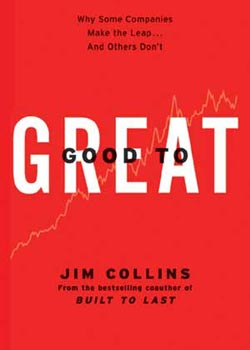

# Good To Great - Jim Collins

## The Book In 3 Sentences
1,435 companies were examined over a 40 year period and from this research, 11 great companies were found went from average or sub-par stock market performance to outperforming the stock market by a factor of at least 3 for at least 15 years. The commonality found between all great companies can be summarized as Disciplined People, Disciplined Thought and Disciplined Action. A "flywheel" effect is created while getting from Good to Great that is slow to start but eventually there is a significant buildup of momentum that drives further greatness.

## My 411
A phenomenal read, Good To Great explores how companies that were once mediocre achieved greatness. Jim Collins and his research team did a spectacular job aggregating information of 1,435 companies in the US over a 40 year period to find companies that outperformed the stock market by a factor of at least 3 for at least 15 years. Once 11 companies were short listed, the author and team set out on identifying what was common among the companies. The "secret sauce" of the Good To Great companies was simply "Consistent Discipline". More specifically, discipline in 3 facets each consisting of 2 ideas:

### Disciplined People
Getting the right leader and the right people in the right seats running the show. __The Level 5 Leader__ was the first idea: a level 5 leader is one who has the perfect balance of will and humility amongst other characteristics such as passion, competence, effectiveness and capability. A Level 5 Leader is typically more concerned about the company versus his pay check and is one who is typically hired from within the company rather than one brought in. 

The second idea is to first __get the right people in the right places__ rather than first deciding the vision or strategy. The right people will be self motivated to come up with the right vision and to impart the passion to others. In other words, people aren't your most valuable asset, the right people are.

### Disciplined Thought
__Stockdale Paradox__ is the first idea in this facet: A great company has the discipline to confront the brutal facts about your situation without losing faith about eventually prevailing as a great company. 

The second idea is the __Hedgehog Principle__ that I would consider to be the most important idea of the book. The hedgehog, unlike a fox who pursues multiple goals at once, is great at one thing in case of adversity: curl up into a ball and let its quills take care of any threat. More specifically, the Hedgehog Principle, a principle of imparting simplicity, involves operating in 3 circles in the form of 3 questions:

1. What can you be best in the world at?
2. What drives your economic engine? 
3. What do you feel most passionate about?

Great companies have the discipline to operate within the framework demarcated by the 3 circles while avoiding complexity of pursuing things they have less knowledge about.

### Disciplined Action
Incorporating a __Culture of Disciple__, employees of a great company will only take actions consistent with the hedgehog principle; it's this discipline that reduces bureaucracy, excessive hierarchy and despotic executive control. 

Great companies think about __technology__ in a different way. They only invest in new technology if it serves their hedgehog principle.

### Flywheel

It's through cumulative effort and discipline in the three facets that a company goes from good to sustainably great. In other words, think about greatness as an effect of cumulative action rather than a dramatic singular win. The opposite of the flywheel is the doom loop that a good company can get into if they lack discipline.

Overall, I thought this book was a well-worth quick read. I thoroughly enjoyed the scientific rigor with which all assumptions of the choice of companies as well as their concomitant rationale were stated. The potency of the lessons of discipline was magnified once I started drawing parallels between great companies and leading a great life. The concept of disciplined self, thought and action for an individual can be as efficacious as that for a company and this was truly my main takeaway from the book.