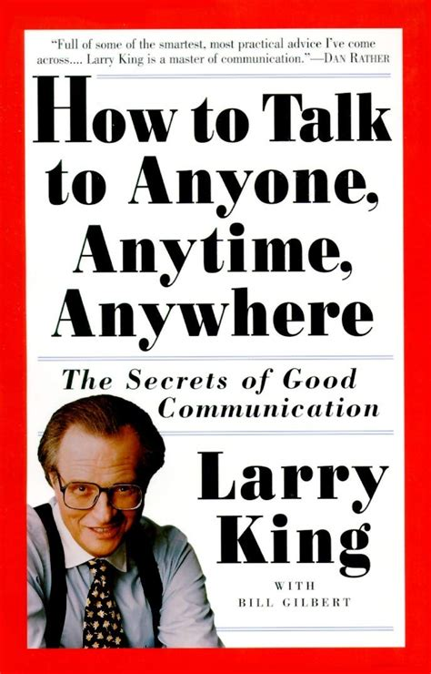

# How To Talk To Anyone, Anytime, Anywhere - Larry King

## The Book In 3 Sentences
Honesty, right attitude, interest in the other person by listening more than talking and openness about yourself are fundamental ingredients in becoming a good talker. Overcome your own shyness and practice talking to others to gain experience and confidence and avoid yes / no questions - the best type of question is "why". Find common ground with the other people, always pay attention to your body language and make natural eye contact with others.

## My 411
An incredible book with a wealth of information, "How To Talk To Anyone, Anytime, Anywhere" by the late legend, Larry King has substantially helped my naturally introverted side get better at socializing and indulging in more meaningful conversation. Imbued with practical advice this book teaches you how to be a better conversationalist in a variety of situations including at cocktail parties, at job interviews, at your place of work or when you are out in public with a stranger. 

My favorite part of listening to this book was how Larry King talking about his own personal stories and how they relate with the fundamentals/rules/tips he covers. With innumerable interviews under his belt, he has a treasure trove of information to offer and he does it in such a tastefully lucid manner that I have planned to listen to this book again. Highly recommend this one to any one who wants to improve their communication skills even if they think they are veterans at the game.

## Notes
1. Fundamentals of Talking
   1. Honesty
      1. Be candid about your fears and anxiety.
   2. The Right Attitude
      1. Develop the attitude even when its uncomfortable.
   3. Interest in the Other Person - LISTEN!
      1. Look people in the eye.
      2. Talk less about yourself and ask intriguing questions about others.    
      3. Acknowledge that you are ignorant in a bunch of subjects and listen to the others opinion / knowledge.
      4. “Talk to people about themselves and they will listen for hours.”
   4. Openness about yourself
2. Talking To Strangers
   1. Overcoming your own shyness
      1. Make others feel at ease by asking them about themselves.
      2. Keep your cool.
      3. No need to feel intimidated and feared.
   2. If someone else is a lot shier than you, help them overcome their fear by getting them to talk about themselves.
   3. Openers
      1. Find out other people's passions.
      2. If you are at someone's place, ask about pictures or momentos.
   4. __Avoid Yes/No Questions!!__
      1. Closed conversations are bad.
      2. Ask __WHY!__.
      3. Remember that people are 1000x times more interested in themselves, than what happens in the world.
   5. Body Language
      1. Find your natural flow with body talk.
      2. Don't cross your arms.
   6. Eye Contact
      1. Look people in their eyes while they talk.
      2. Add natural non-verbal feedback like nodding / shaking your head (in disagreement).
      3. Don't continuously stare into someone's eyes - look away a bit while talking.
   7. Stay Informed
      1. Know what's going on in the world via TV / Internet etc.
3. Social Talk
   1. Fundamentals
      1. Find Common Ground
      2. Be Open
      3. Listen
   2. Cocktail Parties
      1. Don't get caught in one place for too long. Try to mingle.
   3. Greatest Question of All Time: __WHY__
   4. How To Get Out Of A Conversation
      1. Don’t make too much of your exit.
      2. Wait for a slight pause, say something polite and turn away. Like: “It was nice talking to you.”
      3. Examples:
         1. “Excuse me I have to go to the bathroom.”
         2. “Hey (friend) this is (newly met stranger), you should meet. I’ll be back in a minute.” Go somewhere else, and hope you didn’t screw over your friend.
         3. “This food is delicious. I’m going to help myself to seconds.”
         4. “Would you excuse me? I’m going to say hello to the host/friend of mine.”
         5. "Well, I guess I’d better go mingle some more.”
4. 8 Characteristics Of A Good Talker
   1. Looking at things from a new angle
   2. Have broadened horizons
   3. Enthusiasm
   4. Don't just talk about yourself
   5. Be curious
   6. Show empathy
   7. Having a sense of humor
   8. Your own style