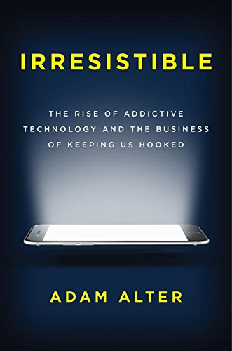

# Irresistible - Adam Alter

## The Book In 3 Sentences
Behavioral Addictions, a mechanism to respond to a taxing physical experience psychologically, is closely associated with environmental context and with dopamine. Behavioral addiction consists of 6 ingredients: compelling __goals__ that are just beyond reach, irresistible and unpredictable positive __feedback__, a sense of incremental __progress__ and improvement, tasks that become slowly more difficult over time i.e. __escalation__, unresolved tensions that demand resolution in the form of __cliffhangers__ and strong __social interactions__ and connections. The ways to solve behavioral addiction are nipping it at birth, creating good habit architectures that divert time and energy from bad habits and gamifying those good habits.

## My 411
Another great recommendation by Brian Johnson's optimize.me, Irresistible by Adam Alter is well researched, easy to follow and filled to the brim with extremely pertinent examples and terrifyingly sobering statistics of how behaviorally addicted we are onto technology. By taking a "meta" view of what is behavioral addiction, what causes it and how to solve it, Adam Alter provides a plethora of studies and solutions to this pervasive problem. 

What I thoroughly appreciated about the book was the large number of personal examples the author used in each of the sections; learning about the author's struggle with addiction made the listen all the more worthwhile. Some of the extreme examples were eye-opening and scary for example, a gaming addict who did nothing but play World of Warcraft for 300+ days.

In the end, the author doesn't advocate for the complete expulsion of technology but a balanced approach that extirpates the addictive aspect of it in an effort to spend more time doing more meaningful enriching activities. I highly recommend this book! 

## Notes
1. __What Is Behavioral And Where Did It Come From__
   1. Behavioral addictions arise when a person can’t resist a behavior, which, despite addressing a deep psychological need in the short-term, produces significant harm in the long-term.
   2. Discovered the 'pleasure centre' of the brain. They implanted a small probe, which delivered a burst of electric current to each rat’s brain when the rat pressed a metal bar. To their surprise, instead of retreating, Rat No. 34 stubbornly scampered across his cage and pressed the bar over and over again.
   3. Product designers are smarter than ever. They know how to push our buttons and how to encourage us to use their products not just once but over and over.
   4. “Nomophobia” - the fear of being without mobile phone contact (an abbreviation of “no-mobile-phobia").
2. __The Ingredients Of Behavioral Addiction__
   1. __Goals__
      1. Humans are goal oriented; we look ahead rather than backward, so no matter where we stand, we’ll tend to focus on people who have more.‍ 
      2. Addictive technologies work on the premise that if you want to compel people to act, you whittle down overwhelming goals into smaller goals that are concrete and easier to manage.
      3. __Solution__: Instead of goals, live your life by systems. A system is “something you do on a regular basis that increases your odds of happiness in the long run.”.
   2. __Feedback__
      1. Feedback—in the form of lights or sounds or any change in the state of the world—is pleasurable.
      2. Juice refers to the layer of surface feedback that sits above the game’s rules. It isn’t essential to the game, but it’s essential to the game’s success. Without juice, the same game loses its charm.
   3. __Progress__
      1. Many game designers know that beginner’s luck is a powerful hook.
   4. __Escalation__
      1. There’s very little evidence that people with regular lives become happier when you replace challenges with ease.‍
   5. __Cliffhangers__
      1. Incomplete experiences occupy our minds far more than completed ones.
      2. When the rewards were unpredictable, participants enjoyed them that much more—and continued to enjoy them through to the end of the experiment.
   6. __Social Interaction__
      1. People are endlessly driven to compare themselves to others.
3. __The Future Of Behavioral Addiction__
   1. __Nipping Addictions At Birth__
      1. From childhood we should limit screen time and opt in to choose technology that doesn't get us hooked on. 
      2. The following should be encouraged to nip digital addictions at birth:
         1. In-person interaction over digital interaction.
         2. Slow paced shows vs. fast paced ones that minimizes attention residue.
         3. Decreasing the gap between the digital world and real world is key.
   2. __Habits And Architecture__
      1. A well designed environment encourages good habits and healthy behaviors; the wrong environments and excess leads to behavioral addiction.
      2. The key to overcoming addictive behaviors is to replace them with something else that's not as harmful vs. abstaining from them completely.
      3. Smart behavioral architects know the ingredients of behavioral addiction and they plan around them by:
         1. Designing temptation-free environments
         2. Know how to blunt unavoidable temptations
   3. __Gamification__
      1. Create games out of the good habits that replace the bad ones.
      2. This might not be a good long term solution but could work for the short term.
      3. Gamification is induced by companies e.g. loyalty programs using:
         1. Points
         2. Badges
         3. Leaderboards