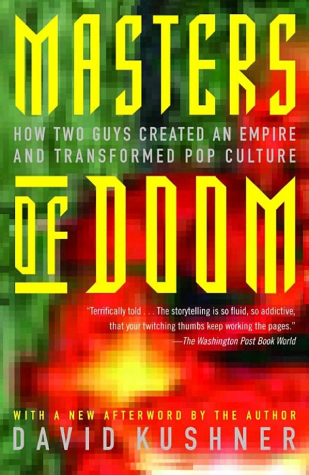

# Masters of Doom - David Kushner

## The Book In 3 Sentences

Masters of Doom covers the rise and further rise of ID Software, a video game development company responsible for games such as Doom and Quake, by shedding light on the background and achievement of two of the main founders - John Romero and John Carmack. John Romero, the rock star, advocated for better design and was the people's person at ID. John Carmack, the Rocket Scientist, is the reclusive genius who engineered game engines whose code still runs in a lot of the games we play these days.

## My 411

Whenever I feel low on inspiration at work or want an extra kick in my developer ass, I turn to Masters of Doom. This book is incredibly well written and documents the early lives of both the Johns, the fortuitous event of their meeting, early years of struggle at Softdisk and then the rise and continued growth of ID Software. The book subsequently divs into the cultural phenomenon ID Software was instrumental in creating and the years following Romero's departure and the competition between ID Software and Ion Storm.

Despite the meteoric success of ID Software, it was rife with internal struggles and problems. The book doesn't hide any of the gory details of backstabbing behavior and office politics and provides an incredibly honest view of what really happened.

I have distinct memories of playing Doom for the first time on my uncle's laptop after he completed his MBA from the States. I was blown away by the sheer immersive experience and the tight feedback loop of observing the screen redrawn after mashing buttons on the keyboard. I am fairly certain being witness to the experience of playing Doom was what eventually got me to start coding and therefore, reading about the company that brought me that experience was an incredible treat.

John Carmack is one of my absolute engineering heroes and learning about his background and his undeniable genius and work ethic was the most inspiring aspect of this book for me. Highly recommend this great read for anyone wanting to learn about one of the biggest gaming powerhouses and get some inspiration to start developing!