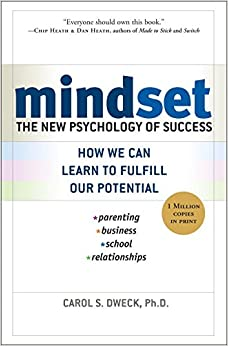

# Mindset: The New Psychology of Success - Carol Dweck

## The Book In 3 Sentences
The mindset we adopt permeates every nook and cranny of our life; more specifically, we can choose to have a "fixed" or a "growth" mindset. By inculcating a fixed mindset, one believes their self-worth, intelligence and talent are static i.e. "either I have it or I don't" while on the other hand, with a growth mindset, one embraces challenge and uses failure not as permanent label but as a stepping stone to learn from mistakes i.e. "genius is made and not born". A plethora of examples in various spheres of life including sports, business and parenting highlight the sustainable benefits of a growth mindset that focusses on years of passion, toil and training in contradistinction with a fixed mindset that focuses on getting bogged down by failure, insecurity, playing the blame game and not taking criticism well.

## My 411
A recommended book by Microsoft to its employees, this book was an exceptional read! I remember first hearing about it before I joined Microsoft from my then skip level manager who indicated that a growth mindset based culture is what Microsoft strives for. The book is a result of many years of research by the author, Carol Dweck, who is an extremely esteemed researcher at Stanford University. The main observation from her research and interviews is that most successful people adopt a growth mindset and don't let failure bring their learning to screeching halt.

After describing what a growth and fixed mindset are, the author spends the rest of the book going through examples revolving around why the growth mindset leads to eventual and sustainable success and why the fixed mindset is a deterrent to progress and learning. Different areas where real life examples of both fixed and growth mindsets were presented are:

1. _Sport_: The most successful athletes are those who didn't rely purely on their talent to achieve their successes but worked non-stop and as a result, their mindset shaped their "champion" character. My favorite example from this section was that of Michael Jordan who in his early years wasn't considered a good basketball player however after years of diligent practice, became the best basketball player of all time.
2. _Business_:  The best CEOs encourage criticism from their executive team (preventing 'Group Think' that leads to sycophantic behavior), care more about serving their customers and employees and are obsessed with continued learning. The example that inspired me the most was that of Anne Mulcahy, the former CEO of Xerox, who joined when the company was $17 billion in debt but saved the company from the jaws of bankruptcy. A counter example of Lee Iacocca, the former CEO of Chrysler, was presented and it was made clear that his fixed mindset lead to life long insecurity that caused irreparable damage to the company. 
3. _Parenting_: Parents play a pivotal role in the early development of the mindset of their children. The advice here was that parents should praise the _efforts and not the achievements of their children as the former leads to learning how to deal with failure and in the direction of the growth mindset and the latter to entitlement and the fixed mindset.
4. _Teaching_: The best teachers are those, like parents, who encourage the growth mindset vs. a fixed mindset by constantly challenging their students to work harder and most importantly, teach them how to view failure as a positive experience that eventually leads to growth.

One of my favorite examples from the book in popular media was that of Bill Murray's character from one of my favorite movies, Groundhog Day. Not going to spoil the movie but it is definitely worth seeing! By the end of the book, I felt empowered by the lessons imparted from the book and have a starting viewing success and failure in a different light. While listening to the book, I reflected back on to a lot of times when I adopted a fixed mindset approach and how the outcome could have been different if I had been more growth oriented; can't change the past but I am excited to make more mistakes and fail harder than last time in the future!