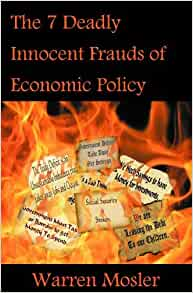

# Seven Deadly Innocent Frauds of Economic Policy - Warren Mosler

## The Book In 3 Sentences
Modern Money is a spreadsheet the Fed controls without risk of default and the purpose of taxation is to enforce the fiat currency system and to control spending power so as to get a handle on inflation. A country's wealth is based on how many goods and services it produces and imports subtracted from what it exports and therefore, to optimize the wealth of a country, if the output doesn't meet capacity, cutting taxes will reduce the deficits and stimulate the economy. Some politicians and economists have warped the core concept of modern monetary theory to aid in their favor and as a result, mass misinformation is the norm.

## My 411
An eye-opening book about how and why conventionally accepted notions of money that are promulgated by politicians and some economists are horribly incorrect. Political motives have blinded the common man from truly understanding how the monetary system works and this book's main goal is to expose these almost-pervasive misunderstandings and correct them by fastidiously explaining how money really works. The concepts are extremely easily explained with well chosen analogies and common sense that even a high school student with no prior knowledge in economics can understand what's going on. 

I was lucky enough to intern multiple times at the hedge fund Warren Mosler headed and glad some of that much lacking common-sense about money rubbed off on me. 

## Notes
1. __Modern Monetary Theory__
   1. Modern Money is a spreadsheet. It works by computer.
   2. When a government spends or lends, it does so by adding numbers to private bank accounts.
   3. When it taxes, it marks those private accounts down.
   4. When it borrows, it shifts funds from a demand deposit (reserve account) to savings (security account).
   5. The money the government produces doesn't come from anywhere and doesn't cost anything to produce as it's all a digital spreadsheet.
      1. The government cannot therefore run out of money that's digital i.e. there is no solvency risk.
   6. __Purpose of Taxes__
      1. Money is created by government spending i.e. spending on goods and services or bank loans, which create deposits.
      2. Taxes serve to make us want that money as we need money to pay taxes.
      3. Taxes help regulate total spending, so that we have more total spending than we have goods available at current prices.
   7. __Public debt isn't a burden for the future__
      1. Things produced in the future will be consumed in the future.
      2. The amount is dependent on how productive the economy is at that time.
      3. A higher public debt today does not reduce future production - and if it motivates wise use of resources today, it may increase the productivity of the economy in the future. 
   8. Public deficits increase financial private savings - dollar for dollar.
      1. Imports are a benefit, exports a cost.
   9.  Security privatization would just reshuffle the ownership of stocks and bonds in the economy
       1.  Transferring risky assets to seniors and safer ones to the wealthy – without having any other economic effects. 
       2. The rates are set by the government.
2.  __What are Innocent Frauds?__
       1.  The presumption of innocence implies those perpetuating the fraud are not only wrong, but also not clever enough to understand what they are actually doing.
3.  __2 Schools of Thought How Government Regulates the Economy__
    1. __Keynesian View - Galbraith__ 
        1.  __Fiscal Policy__: Fiscal policy is the means by which a government adjusts its spending levels and tax rates to monitor and influence a nation's economy.
            1.  Spending is also called __Aggregate Demands__.
    2.  __"Monetarists" - Milton Friedman__
        1.  Monetarist believe that the federal government should always keep the budget in balance and use monetary policy to regulates the economy.
        2.  __Monetary Policy__: Monetary policy is the policy of using interest rates as the instrument of monetary policy rather than any measures of the quantity of money.
4.  __Seven Deadly Innocent Frauds of Economic Policy Categorized__
    1.  __Concerning The Fed's Budget Deficit__
        1.  The government must raise funds through taxation or borrowing in order to spend. In other words, government spending is limited by its ability to tax or borrow.
        2.  With government deficits, we are leaving our debt burden to our children.
        3.  Government budget deficits take away savings.
    2.  __On Social Security__
        1.  Social Security is broken.
    3.  __Trade__
        1.  The trade deficit is an unsustainable imbalance that takes away jobs and output.
    4.  __Savings and Investments__
        1.  We need savings to provide the funds for investment.
    5.  __Fed Budget Reprised__
        1.  It’s a bad thing that higher deficits today mean higher taxes tomorrow.
5.  __Deadly Innocent Fraud #1__: The federal government must raise funds through taxation or borrowing in order to spend. In other words, government spending is limited by its ability to tax or borrow.
    1.  __Fact__: Federal government spending is in no case operationally constrained by revenues, meaning that there is no “solvency risk.” In other words, the federal government can always make any and all payments in its own currency, no matter how large the deficit is, or how few taxes it collects.
    2.  __How does the Federal Government Tax?__
        1.  If you pay your taxes via __checks__, it's a simple deduction to your account i.e. a monetary spreadsheet.
        2.  If you pay your taxes via __cash__, the cash is eventually shredded. 
            1.  No further use of it like a Superbowl ticket after the Superbowl. 
    3.  __How the Federal Government Spends?__
        1.  Government spending is all done by data entry on its own spreadsheet called the "The US Dollar Monetary System".
        2. The Fed gives out money (spend and lend) simply by changing numbers in bank accounts.
        3. The federal government doesn’t ever “have” or “not have” any dollars.
           1. "Computer data doesn't come from anywhere"
           2. Points in a football game don't just come from anywhere.
        4.  How the federal government pays for it is true changing numbers in a bank account.
            1. All it takes for the fed to spend / borrow is data entry.
        5. There is no numerical limit to how much money our government can spend, whenever it wants to spend.
        6.  This is not to say that excess government spending won’t possibly cause prices to go up (which is inflation). But it is to say that the government can’t go broke and can’t be bankrupt. There is simply no such thing.
        7.  The fed is a __scorekeeper__ - it neither has/doesn't have dollars as much as a bowling alley has a box of points.
    4. __Solvency Risk and it's Implications__
       1.  __Solvency Risk__: Risk of default.
       2.  This risk doesn't exist for the fed i.e. "Government Checks don't bounce".
           1. Government deficits can never cause a government to miss any payment.
       3.  Despite none of this risk, the fed should be careful as overspending can jack up prices and fuel inflation.
   10. __Why The Federal Government Taxes__
       1. Taxes create an ongoing need in the economy to get dollars, and therefore an ongoing need for people to sell their goods and services and labor to get dollars.
          1. Citizens must have money to be able to make tax payments.
          2. Dollars needed to pay taxes must make our way to us via government spending (or lending).
       2.  Taxes aren’t about getting money to spend, they are about regulating our spending power or "aggregate demand" to make sure we don’t have too much and cause inflation, or too little which causes unemployment and recessions.
           1.  The government taxes us and takes away our money so that we have less to spend which makes the currency more scarce and therefore, more valuable.
           2.  The purpose of taxes is to balance the economy and make sure it's not too hot nor too cold.
   11. Federal government spending should be set at the "right" amount given the size and scope of the government infrastructure.
       1. When the government takes resources i.e. taxes for its own purposes, there are that many fewer real resources left for private-sector activity.
       2. The government taxes us and takes our money away to prevent inflation, not to actually get our money in order to spend it.
          1. Taxes function to regulate the economy, not to give Congress money to spend.
6. __Deadly Innocent Fraud #2: With government deficits, we are leaving our burdens for our children__
   1. __Fact__: Collectively, in real terms, there is no such burden possible. Debt or no debt, our children get to consume whatever they can produce.
      1. “Higher deficits today __DON'T__ mean higher taxes tomorrow.”
   2. “When our children build 15 million cars per year 20 years from now, will they have to send them back in time to 2008 to pay off their debt? Are we still sending real goods and services back in time to 1945 to pay off the lingering debt from World War II?”
   3. A US Treasury Security is nothing but a savings account at the Fed.
      1. When you buy a treasury security, you send your dollars to the Fed and then sometime in the future, they send dollars plus interest.
      2. First the fed reduces some amount from your account and then adds back the numbers.
   4. When the US government borrows money, all it does is moves funds from checking accounts (Reserve Accounts) to savings accounts (Treasury securities).
      1. When the debt becomes due, the fed simply shifts the funds back from the savings to the checking accounts (Reserve Accounts).
7. __Deadly Innocent Fraud #3: Government budget deficits take away savings__:
   1. __Fact__: Federal Government budget deficits ADD to savings.
   2. In accounting, credits have to equal debits and therefore, government deficits add to our savings as it is this deficit that the government spends that gets circulated and eventually in our pockets.
8. __Deadly Innocent Fraud #4: Social Security Is Broken__ 
   1. __Fact__: Federal Government Checks Don't Bounce.
      1. There is no operational constraint on the government's ability to meet all Social Security Payments.
   2. __Fallacy of Consumption__: Consuming food does not create anything valuable, it eliminates something valuable. The same is true when we use up part of the productive potential of a household appliance or other consumer durable.
      1. The typical textbook example of a fallacy of composition is the football game where you can see better if you stand up, and then conclude that everyone would see better if everyone stood up. Wrong! If everyone stands up, then no one can see better, and all are worse off. 
   3. Participating in Social Security is equivalent to buying a government bond.
9.  __Deadly Innocent Fraud #5: The trade deficit is an unsustainable imbalance that takes away jobs and output.__
    1.  __Fact__: Imports are real benefits and exports are real costs. Trade deficits directly improve our standard of living. Jobs are lost because taxes are too high for a given level of government spending, not because of imports.
    2.  Going to work to produce real goods and services to export for someone else to consume does you no economic good at all unless you get to import and consume the real goods and services in return.
    3.  The real wealth of a nation is all it produces and keeps for itself, plus its imports minus its exports.
    4.  A trade deficit _increases_ our standard of living.
    5.  Jobs maybe lost due to importing, however, with the right fiscal policy, there will always be sufficient domestic spending power to be able to employ those willing to work, producing other goods and services for consumption.
10. __Deadly Innocent Fraud #6: We need savings to provide the funds for investment.__
    1.  __Fact__: Investment adds to savings.
    2.  __The Paradox of Thrift__: In our economy, spending must equal all income, including profits, for the output of the economy to be sold.
        1.  If anyone attempts to save by spending less than his income, at least one other person must make up for that by spending more than his own income, or else the output of the economy won’t get sold.
        2.  Unsold output means excess inventory, low sales means production and employment cuts and thus, less income.
        3. The decision to save by not spending income result in less income and no new net savings.
        4. Conversely, decisions to spend more than one’s income by going into debt cause incomes to rise and can drive real investment and savings.
    3. Savings is the account record of investments. 
11. __Deadly Innocent Fraud #7: It’s a bad thing that higher deficits today mean higher taxes tomorrow.__
    1. __Fact__: Lowering taxes will decrease deficits and then cause taxes to increase in the future.
    2. Government taxes to take away our spending power to control inflation.
    3. We are running into deficits because of unsold goods and services causing unemployment to be high and output lower than capacity.
    4. The government is buying what it wants from these unsold goods and services, however we don't have enough after-tax spending power to buy what's left.
       1. So, we cut taxes and increase government spending to increase spending power and help clear the shelves of unsold inventory.
    5. In this situation of high deficits, we'd want to decrease taxes so that our spending power increases and therefore, decrease our deficit.
12. __Proposals__
    1.  __“Full payroll tax holiday"__
    2.  __Distribute $500/Capita Of Revenue Sharing__
    3.  __Restoration of American prosperity through a federally-funded $8/hr. job__