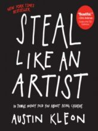

# Steal Like An Artist - Austin Kleon

## The Book In 3 Sentences

Nothing is original as it's built on things before and therefore, copy your heroes and transform their work into something of value for others. Keep a journal, log book, a calendar and a notepad for keeping track of new ideas, noting interesting things that have transpired to spark more ideas and a way to track your experiences. Creativity is about subtraction and it's boring routine that induces it further.

## My 411

The first of the "Steal Like An Artist" trilogy by Austin Kleon, Steal like An Artist was a short, albeit insightful read. Clear cut gems of advice wisdom presented as a lucidly as possible was the format of the book - kind of like a coffee table book for philosophers and I like it! 

My favorite part of the book was all the amazing quotes from eclectic sources that galvanized the lessons from each chapter. The nugget sized life lessons were definitely worth it - this might be the shortest audiobook I came across spanning just an hour! I plan to finish the rest of this trilogy as I did enjoy this book.

## Notes

1. __Steal Like An Artist__
   1. Nothing is original as it's built on things before (usually a combination of things that came before).
      1. Embrace influence rather than running away from it.
   2. Your job is to collect good ideas from EVERYWHERE - the more good ideas you collect, the more you can choose from.
   3. Chew on one thinker and then chew on three people the thinker loved and chew on their work. Repeat.
   4. Google EVERYTHING. Always be reading and learning.
   5. Carry a notebook and jot down your ideas.
2. __Don't Wait Until You Know Who You Are To Get Started__
   1. It's the act of making things and doing our work that we figure out who we are and not the other way around.
      1. No one truly knows where the genius creative stuff comes from, they just show up. Every day.
3. __Fake it till you make it__
    1. Pretend someone who you are not until you are.
    2. Pretend to make something until you actually make something.
4. __Start Copying__
    1. In the beginning, we learn by copying our heroes.
    2. Copying != Plagiarism
        1. Copying is about reverse engineering.  
    3. First we need to find our heroes to copy and then figure out what to copy.
    4. Steal from all your heroes and not just one.
    5. Steal the thinking behind the style of your heroes.
5. __Imitation Is Not Flattery__
    1. At some point, imitation becomes emulating your heroes.
        1. Emulation is when imitation breaks into your own thing.
    2. Our failure to perfectly copy our heroes makes our own thing live - this is how we evolve.
    3. Copy your heroes, examine where you fall short.
    4. Transforming their work into something that's yours is the way to flatter your heroes and not by imitation.
6. __Write the Book You Want to Read__
    1. Create what you want.
    2. Whenever you are at a loss for what move to make next, just ask yourself "what would make a better story?".
    3. DO the work you want to see done.
7. __Use Your Hands__
    1. The computer isn't good for generating ideas as it brings the perfectionist in us - we start editing ideas before we have them.
    2. Hands first, then computer, then hands again.
    3. Separate your workspace into digital and analog space.
        1. In your analog space, you keep anything electronic out and this is where you do your "thinking" work.
8.  __Side Projects And Hobbies Are Important__
    1.  Practice Productive Procastination
        1.  Get bored!
        2.  Side projects is where the magic happens.
    2.  Don't throw any of your passions away
9.  __The Secret: Do Good Work And Share Them With Others__ 
    1.  Use the internet to share your work.
    2.  Wonder at something.
    3.  Invite others to wonder with you.
10. __Geography Is No Longer Our Master__
    1.  Be still and alone.
    2.  All you need is a little space and bit of spare time.
        1.  A little self imposed solitude and temporary captivity.
    3.  Leave home! Your brain works harder in new places.
11. __Be Nice__
    1.  Make friends, ignore enemies.
    2.  Stand next to the talent
        1.  Follow your heroes.
    3.  You need:
        1.  Curiosity
        2.  Kindness
        3.  Stamina
        4.  A willingness to look stupid
    4.  Quit picking fights and go make something
    5.  Write fan letters to show your appreciation but don't expect anything in return.
    6.  The trick is to be too busy doing your work to care.
12. __Be Boring__
    1.  It takes a lot of energy to be creative - you don't have energy to if you waste it on other stuff.
    2.  Stay out of debt - the art of saving money is all about saying no to consumer culture.
    3.  Keep your day job!
        1.  Routine induces creativity.
    4. A good partner keeps you grounded.
    5. Keep a calendar to track your progress with skills.
13. __Creativity Is Subtraction__ 
    1.  The way to get creative is to place constraints. Limitations mean freedom.
    2.  The right constraints lead to the best work.