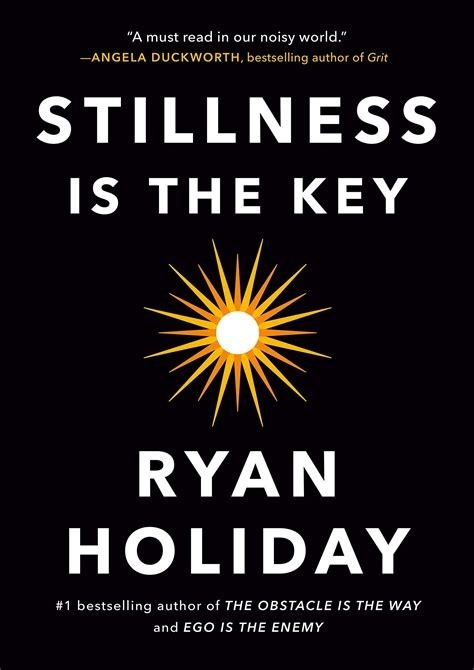

# Stillness is the Key - Ryan Holiday

## The Book In Three Sentences
A civil war is constantly raged within ourselves and the only way to win is to be still as it is via the state of stillness is how we achieve greatness - the greatness of peace, genius and eventually enlightenment. The mind, body and spirit must be in masterful harmony with each other to achieve stillness. All wisdom of the ancient world, whether it is Buddhism, Stoicism, Hinduism or Christianity agrees that a life of on-command stillness will lead to a good life and eventually, a good death.

## My 411
There are few works of art that have left me in goosebumps or have got me shouting "F*CK!" multiple times at the top of my lungs enough to get a noise complaint from the neighbors. This is THAT book for me. The famous screenwriter and director has a famous quote "I don’t have many rules in life, but one I never
break is: If Ryan Holiday writes a book, I read it as soon as I can get my hands on it.” and I have finally understood why. After much pontification about why the material in this book elicited such as an extreme emotional response is because I believe everything that Ryan went over is true, it's just I hadn't articulated or seen it presented to me in such a simple way. 

An eclectic choice of philosophies were strategically merged to create, in my opinion, essential reading. 

The book starts off with highlighting why stillness is the key by giving the example of Lincoln during the civil war and how through much introspection and deep thinking that eventually granted him the stillness to realize that Vicksburg was the 'key' to win the civil war and stop slavery. And he did exactly that. 

There are three parts of the book each involving a domain that have to be in harmony to achieve stillness: the mind, the spirit and the body. Each of these parts introduces concepts that lead to mastery of each of these domains backed by a plethora of extremely apt examples. 

_The Mind_
The starting example: John F Kennedy and the Cuban Missile Crisis. Key lessons here:
1. _Become Present_: Do deep work i.e. don't be constantly distracted. 
2. _Limit Your Inputs_: The adage 'your body is a temple' can be extended to the mind. Limit what you ingest by exhibiting the discipline of discrimination. 
3. _Empty the Mind_ and _Slow Down, Think Deeply_: Clear your mind through meditation; as a paradox, the empty your mind is, the more slowly you can think and the better your quality of thoughts will be.
4. _Start Journaling_: Journaling is like activating your spiritual windshield wipers and the paper has more patience than people. I have started journaling! Combining this exercise with some of my other Stoic practices is a match made in heaven.
5. _Let go_: Have a fatalistic Zen like attitude towards the past and while doing an important task, be still and let your subconscious take over.

_The Spirit_
The starting example: Tiger Woods and his addictions. Key Ideas:

1. _Choose Virtue_: Virtue, according to Stoics, is the highest good and therefore, should be the principle all our actions.
2. _Heal the Inner Child_: A lot of the evil in the world is because of the hurt inner child in us that was wronged. Strive to heal this inner child by loving yourself and by giving. Giving to others what was taken away from you.
3. _Beware Desire_: Desire makes you a slave and keeps you away from stillness.
4.  _Enough_: Contentment of contentment is contentment. Knowing when to say 'enough, I don't need any more' is one of the secrets to happiness. 
5. _Accept a Higher Power_: By submission to a higher power, whatever it is, you are avoiding nihilism that can deviates you from stillness. Even the laws / the way of the universe is what you can submit to.
6. _Conquer Your Anger_: Anger is the opposite of stillness. Conquer it and keep your impulses checked.

_The Body_
The starting example: Winston Churchill (My favorite example used). Key points:

1. _Say No_: Learn to say no; be more cognizant of who and how you spend your time.
2. _Take a Walk_: Coincidentally, listened to this book while doing my steps. Ryan talks about how mindful walking is a form a meditation; a lot of the genius ideas of people came to them while walking.
3. _Build A Routine_: Routine puts your mind at bay. Paradoxically, you are more at peace with the monotony of routine as it devices a cadence of doing and that type of doing is equivalent to meditation as there are fewer things to worry about in a routine.
4. _Get Rid of Your Stuff_: Be a minimalist. Don't let your things own you.
5. _Go To Sleep_: Get your rest. You are a human being and not a machine.
6. _Find a Hobby_: A hobby will give you the solitude that regular work cannot.
7. _Beware Escapism_: Don't use stillness as a way to escape from your problems as they will always be there. Use stillness to confront your problems.

It's through inculcating these ideals you achieve stillness in life and that stillness translates to a life of peace. It's only through a life of peace is how you can die peacefully. Those you are in denial of their mortality are ignorant and stillness is the way to acceptance.

If there is one book you choose from the ones I have recommended, it should be this one. Without a doubt one of the most profound books I have ever read and has now made me a Ryan Holiday superfan. Stillness is truly the key.