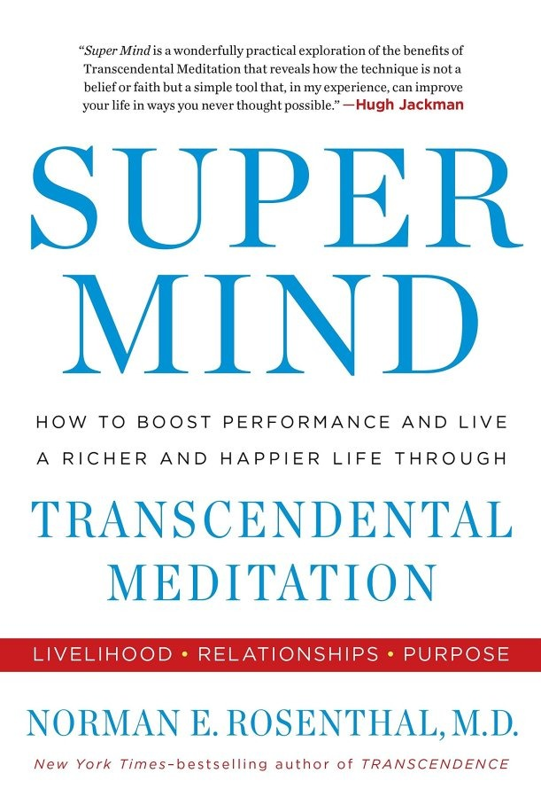

# Super Mind - Norman E Rosenthal

## The Book In 3 Sentences
The Super Mind is a _state_ of transcendence of modified consciousness where one can operate more efficiently through the ups and downs of life and can be achieved by practicing Transcendental Meditation (TM) twice day for 20 minutes each. Those who practice TM regularly for prolonged amounts of time have different brain waves and are less prone to heart disease and strokes amongst a plethora of other benefits such as calmness through difficult situations, being "in the zone" more easily and general overall happiness. The next stage of the Super Mind is cosmic consciousness that is indicative of actualized transcendental potential where you are one with nature.

## My 411
As a practitioner of TM for the past 4 and a half years, I was excited to read a book that dived deep into the benefits of consistent meditation and I was presented just that. This book documented many interviews of practitioners across different backgrounds and the benefits observed by them. Additionally, scientific research of health improvements were mentioned including changes to the brain structure and brain waves and studies of secretion of "feel good" hormones during TM. The author scientifically proved via brain wave and CAT scans that TM accelerate the development of the prefrontal cortex (CEO of the brain responsible for executive functions, such as planning, decision making, short-term memory) and control of the amygdala (The fire marshal of the brain responsible for emotional responses including fear, anxiety, and aggression).

Common benefits of TM included a sense of calmness, better concentration, increased creativity and elevated mental states leading to better recovery from depression. These aforementioned benefits were shared across the board by interviewees including Ray Dalio, Russell Brand, Hugh Jackman, Jerry Seinfeld and Howard Stern to name a few. Another interesting section was how TM was taught to individuals suffering from Bipolar disorder, ADHD and schizophrenia with positive results i.e. those with the conditions were calmer through their episodes and had a bit more control over the emotions. 

Personally, I have experienced a lot of these benefits every time I am on a TM streak. I feel luckier, less prone to making the wrong decision, am more calm and can concentrate better as I am able to get into the flow a lot better; this was my favorite part of the read i.e. I related to a lot of the benefits experienced by others and was thrilled to hear about the continued and amplified benefits if I were to be consistent over a long period of time.

I would, however, _not_ recommend this book to readers who aren't familiar with the TM technique as this book would seem more like a marketing scheme than a collection of interviews and scientific research as the benefits are best experienced rather than read. The book doesn't go into how to practice the technique at all and this can be a big turnoff as with all the anecdotes and research presented, one would expect at least a section on how what the author is raving about can actually be achieved. The book also did seem monotonous as it repeated a lot of the same information and by the end of the read, I was bored because of the diminishing return of repetitive information. Furthermore, I felt parts of the book were all over the place as the author didn't give the material much structure and filled chapters with more-than-necessary-number of examples. Regardless of my qualms with the reading, the book did make me want to practice TM more and continue to strive for a Super Mind; this Kool-Aid I am willing to take drink by the gallons.