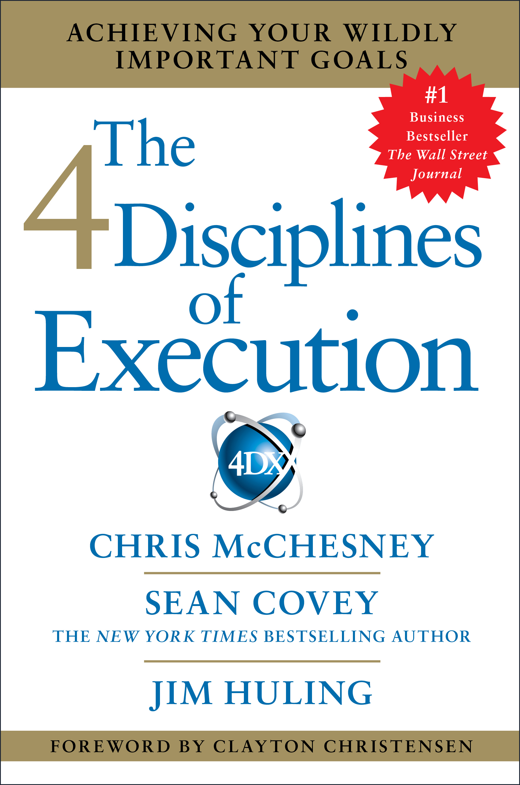

# The 4 Disciplines of Execution - Franklin Covey

## The Book In 3 Sentences
Execution is more important than strategy and execution of new ideas while still working on sustaining operation requires discipline as it requires a organizational behavioral change. The 4DX or 4 Disciplines of Execution consist of _focussing_ on a wildly important goal (lag measure) that you and your team decides, _leveraging_ lead measures to indicate if you you'll be able to reach your wildly important goal, _engaging_ with your team by creating a scoreboard with your lead and lag measures and inculcating a cadence of _accountability_ by engaging in weekly meetings. The 4DX is all about simplicity and transparency, the two secret ingredients of executional success.

## My 411
I found out about this book through Cal Newport's [Deep Work](DeepWork.md) and immediately bought it. A fantastic read with extremely actionable nuggets of wisdom scattered across incredibly well organized chapters. The book truly teaches you how to execute in a world where too much emphasis is given to strategy. Simplicity of the methodology is the biggest reason for adoption; the fact that I was able to take the lessons from each chapter and start applying them to my work is testament to its efficacy. My favorite part of the book was real testimonials of adopters, specifically the ones who used the methodology in non-business contexts such as to lose weight. I highly recommend this book to anyone who has a goal in mind and want a proven way to achieve it by leveraging the lessons learnt from the authors' 1500+ consulting engagements.

## Notes
1. __The Strategy/Execution Gap__
   1. Strategy, rather than execution, is what most MBA programs teach you and what executives focus on. However, it is this gap in strategy and execution where most plans fail.
   2. This gap exists because a behavioral change is needed for the successful execution of a plan amidst operational activities or the __whirlwind__.
2. __The Wildly Important Goal (WIG) vs. Whirlwind__
   1. The whirlwind is the day job or the operational work to sustain a business.
   2. The whirlwind prevents you from achieving your wildly important goals as a behavioral change is needed. 
3. __Discipline 1 - The Discipline of Focus: Focus on the Wildly Important__
   1. Picking 1 or two Wildly Important Goals (WIG) that you want to achieve is the crux of the discipline. 
   2. By focusing on one or two goals you defeat the whirlwind as rather than being scatterbrained, you are directing your efforts into a set number of goals.
   3. __How To Choose Your WIG__
      1. Brainstorm all possible goals and shortlist as many as possible.
         1. Question to ask: _“Which one area of our team’s performance would we want to improve most (assuming everything else holds) in order to achieve the overall WIG of the organization?”_.
         2. Rank the choices by __impact__.
         3. Test the shortlisted WIGs for how they'll impact the overall organization's goals.
         4. Make sure the chosen WIG is achievable. 
   4. __Rules Of Discipline 1__
      1. No team focuses on more than two WIGs at a time.
      2. The battles chosen must win the war. WIGs lower in the organization must serve to achieve the WIGs at the top of the organization.
      3. Senior leadership can’t set the lower-level WIGs but they can veto.
      4. All WIGs should be in the form of going from X to Y by a certain date. 
4. __Discipline 2 - The Discipline of Leverage: Act On The Lead Measures__
   1. The form of the WIG i.e. _Go From X To Y by [a date]_ encapsulates the lag measure.
      1. For example for the WIG: _"Increase annual revenue from $100M to $150M by December 31st, 2021"_ - the lag measure is the annual revenue.
   2. You can’t “do” lag measures, as they are byproducts that indicate if a WIG is achieved rather than those that tell you how close you are to achieving your WIG.
   3. __Lead Measures__ are the following that help you achieve the lag measure.
      1. __Predictable__: measures that lead to the goal 
      2. __Influenceable__: measures that you or your team can directly improve. 
   5. The team should choose their own lead measures by selecting activities that will have the most impact on achieving the WIG.
      1. Choosing the right lead measure is vital to the success of execution.
   6. 2 Types of Lead Measures:
      1. __Small Outcomes__: Achieving a result. For example: Limit out of stock options to 5% of the time. 
      2. __Leveraged Behaviors__: Behaviors to be performed. For example: Ensure workers do X 85% of the time.
   7. __How To Choose Lead Measures__
      1. Consider All Possibilities
      2. Rank by Impact
      3. Test Top Ideas
      4. Define the Lead Measures
5. __Discipline 3 - The Discipline of Engagement: Keep a Compelling Scoreboard__
   1. People play more seriously when they are keeping score.
      1. It's only practice if no one is keeping score.
      2. People aren't as engaged if someone else is keeping score.
   2. To remain engaged, the team should know at all times if they are winning or getting closer to achieving their WIG.
   3. Without knowing the score, staff will be distracted by the whirlwind. 
      1. The feeling of winning, has the most powerful effect on morale and engagement — and it’s something the whirlwind does not provide well.
   4. A visible scoreboard helps the team to work out how to move forward.
   5. Ensure that there is a bullet-proof way to update the scoreboard.
   6. __Characteristics of a Compelling Scoreboard__ 
      1. Simple
      2. Easily visible
      3. Shows both Lag and Lead Measures
      4. Glancing at it should tell you if you are winning
6. __Discipline 4 - The Discipline of Accountability: Create A Cadence Of Accountability__
   1. Each team responsible for a WIG meets at least weekly in a WIG session.
   2. The aim of the WIG session is to hold team members personally accountable, clear the path ahead, solve problems, and commit to actions for the next week.
   3. __The Two Rules Of The WIG Session__
      1. The session is held at the same time every time, at least weekly i.e. The meeting is sacrosanct and should never be avoided. 
      2. The whirlwind is not allowed in no matter how urgent the issue.
   4. __How To Run A WIG Session__
      1. __Account__: Report on individual commitments made the previous session.
      2. __Review the scoreboard__: Learn and problem-solve.
      3. __Plan__: Make new commitments.
         1. New commitments must be a specific deliverable.
         2. Each commitment must aim to move the lead measure.
         3. Commitments should be finished in a week.
            1. Commitments should be formulated by asking: “What are the one or two most important things I can do this week to impact the team’s performance on the scoreboard?”
7. __Common pitfalls__
   1. Don’t mistake whirlwind tasks for WIG commitments. Ask whether the commitment will impact the scoreboard.
   2. Make sure each session has a clear commitment and that they aren’t the same week after week.
   3. If someone hasn’t met their commitment:
      1. Demonstrate respect.
      2. Reinforce accountability. 
      3. Don’t accept unfulfilled commitments
      4. Encourage performance.

## Applications
### 1. Weight Loss
1. __Discipline 1__: I want to go from X lbs to Y lbs by September 24th, 2021.
2. __Discipline 2__: The lead measures I will make use of are
   1. My calorific intake 
   2. Daily Steps + Lifting schedule.
3. __Discipline 3__: My Fitbit Dashboard has all this information.
4. __Discipline 4__: Weekly accountability with friends and family will provide the required cadence of checking.

### 2. Reading More
1. __Discipline 1__: I want to go from reading 11 books / year to 45 books / year by December 31st, 2021.
2. __Discipline 2__: The lead measure I will make use of is time spent on reading / listening to audiobooks.
3. __Discipline 3__: [Here](Progress%20Tracker.ipynb) is my dashboard.
4. __Discipline 4__: Accountability in the Whatsapp group is helping.

### 3. Finance
1. __Discipline 1__: I want to go from a net worth of $X to $Y by December 31st, 2021.
2. __Discipline 2__: The lead measures I will use are: 
   1. The per paycheck $ amount into investments.
   2. My credit card bills to monitor. 
3. __Discipline 3__: Personal capital is my dashboard.
4. __Discipline 4__: Daily review of my finances keeps me in check.