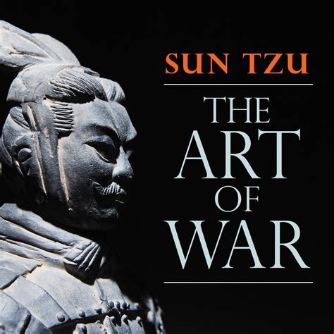

# The Art of War by Sun Tzu

## The Book in 3 Sentences
War is a matter of paramount importance and knowing when to actively engage in it and not is a skill every general/strategist should have. Know yourself and your enemy before strategizing as without this foreknowledge, you'll fail. The art of war is all about deception i.e. keep your enemy always in a state where they don't know your next move and keep your next move a secret.

## My 411
This audiobook listening experience was most unlike the other ones based on both the nature of the material covered in the book as well as how it is presented. The strategies are presented in an aphoristic and prescriptive manner that might pose as a hindrance to continue to listen. I soldiered on by drawing parallels between the trials and tribulations of running a business and warfare; when I started listening with this bent of mind, I found that the book offers pragmatic nuggets of cautionary advice in the strategy of preparation and deception to eventually win. I also found the juxtaposition of the ruthlessly serious advice presented in the book and the cold and monotonous inflections  of reader of the audiobook to be _hilarious_. I plan to revisit this book again to better absorb the material in an effort to get better at drawing parallels to more modern times.