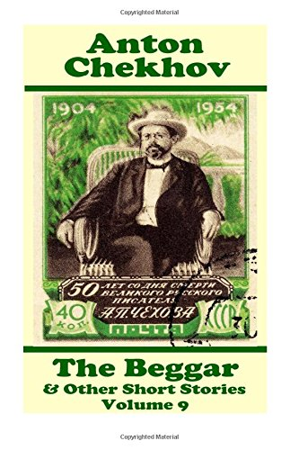

# The Beggar - Anton Chekhov

## The Book In 3 Sentences
The Beggar by Anton Chekhov is a story of a poor, drunkard beggar named Lushkoff who due to laziness and a drinking problem is no longer able to work and resort to begging in order to survive. He also begins to lie about his inability to work hoping to gain others’ sympathy. Sergei, an advocate, provides work for Lushkoff to change him and it is his cook, Olga who is responsible for the positive change in him.

## My 411

Short story. More details [here](https://www.learncram.com/english-summary/the-beggar-summary/).