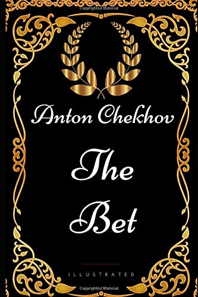

# The Bet - Anton Chekov

## The Book In 3 Sentences

The Bet is an 1889 short story by Anton Chekhov about a banker and a young man who make a bet with each other based on capital punishment and whether the death penalty is better or worse than life in prison. An ironic twist responds to this exploration of the value of a human life with an unexpected result.

## My 411

Short story. Best summary is [here](https://www.gradesaver.com/the-bet/study-guide/summary-the-bet).