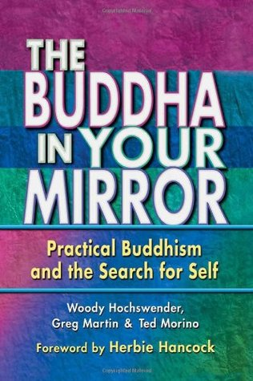

# The Buddha In Your Mirror - Greg Martin, Ted Morino and Woody Hochswender 

## The Book In 3 Sentences
We have the key within us to overcome life's hurdles and are all subjected to the law of cause and effect as we are all interconnected with all other beings and the environment in the universe. The way to happiness in life is through achieving a state of Buddhahood by chanting ``Nam-Myoho-Renge-Kyo`` and thereby changing ourselves to view every obstacle as a growing opportunity. By living a happy life by being the best version of ourselves, we can die happily and without any fear or regrets.

## My 411
This book is overflowing with practical wisdom! I have always been interested in the teachings of Buddhism and this book didn't disappointment (in fact, left me wanting more) in helping me get to the kernel of Nichiren Buddhism. "The message is simple: Chant ``Nam-Myoho-Renge-Kyo`` sincerely and consistently to get rewarded." - as an inveterate skeptic I would have stopped when I read this (paraphrased) sentence and not continued but the explanations that followed made the entire reading process all the more rewarding. More in the notes below.

What makes this book great is the simplicity by which an otherwise seemingly challenging philosophical concept is presented; the ingredients of the secret sauce are the simple language and pertinent examples used. My favorite part of the book was the analogies used to lucidly explain concepts that might be misinterpreted. __Swan's legs__ to represent constant practice that gets rewarded with bliss and __Cherry blossoms__ awaiting to bloom in the winter to represent reincarnation after death conjured up vivid imagery that made crystallization of the concepts even better. 

Another aspect of the book I enjoyed despite by initial skepticism was the congruence of the teachings of Nichiren Buddhism and science particularly, quantum physics that expounds the wave-particle duality of matter subject to constant change. The adroit way the authors weaved a simple explanation of the congruence of the law of constant flux of all existence in Buddhism and Quantum physics was impeccable!

I, also, thoroughly enjoyed reading the foreword by Herbie Hancock as well lending credence to practical nature of the underlying philosophy. His encouraging words were underscored by practical wisdom that set the reading on the right foot.

This book left me feeling empowered and with a new and improved outlook on how and more importantly, __why__ I should view obstacles as fertile ground for growth. Thanks for the great recommendation! I have a feeling I'll be back for seconds. 

## Notes
1. __Chapter 1: The Buddha In Your Mirror__
   1. Buddhism is about action and the Buddha is you i.e. every human contains the inherent capacity to become a Buddha.
   2. Buddhism stressed inner, personal transformation as a way to promote the change in the world i.e. when you change yourself, you change the world.
   3. No divine revelation in Buddhism.
   4. __4 Sufferings__:
      1. Old Age
      2. Sickness
      3. Death
      4. Birth / Living
   5. All things are going change. 
      1. Suffering emerges when we forget this principle of impermanence and believe what we possess will last forever.
      2. __Solution__: Recognize the impermanence and have the courage to accept them.
   6. Interconnectedness Of All Things
      1. All things are related and influence each other.
      2. __Dependent Origination__: All things are subject to the law of cause and effect, and consequently nothing can exist independently of other things.
   7. __4 Nobel Truths__
      1. All existence is suffering.
      2. Suffering is caused by selfish craving.
      3. Eradication of craving brings about the cessation of suffering and enables one to nirvana.
      4. There is a path by which eradication can be achieved i.e. the discipline of the eightfold path.
   8. Dispelling ignorance and establishing the correct "view" is essential.
   9.  __T’ien-t’ai's theory__: The macrocosm is contained in the microcosm.
       1.  Anyone has the potential to achieve Buddhahood.
       2.  Observing the mind through meditation and diving deeper within.
   10. No one can make you happy - it all depends on you. 
2.  __Chapter 2: The Practice__
    1. "A Swan seems to swim calmly, but under the water, invisible to us, it paddles unceasingly" - Buddhist practice is vigorous but the calmness experienced is worth it.
    2. Inner transformation is needed to be enlightened.
    3. Nichiren Buddhism doesn't require the renunciation or suppression of human desires.
       1. Source of all desire is life itself - even the thirst for life is a desire.
    4.  Chant ``Nam-myoho-renge-kyo``.
        1.  Chant for whatever you want.
        2.  Chant with sincerity.
        3.  Has to be consistent.
        4.  Chanting is not passive but dynamic expression of mind and spirit.
        5.  Focuses the mind.
        6.  Chant first and meeting problems head on.
        7.  "Trust the process of chanting even though you don't know the benefits"
            1.  Like the Law of Gravity, it works in all cases. 
    5.  Meaning = _"I devote myself to the mystic law of cause and effect through sound"_
        1.  "Nam" = Devote oneself
        2.  "Myoho" = Mystic Law that the mind cannot comprehend.
            1.  To open
            2.  To revive
            3.  To be endowed with
        3.  "Renge" = Lotus Flower
            1.  Lotus Plan flowers and fruits simultaneously symbolizing "Cause and Effect".
                1.  We create cause and effect through thoughts, words, deeds (Zoroastrian philosophy = Good Thoughts, Good Words, Good Deeds).
            2.  Lotus grows out of mud => Buddhahood from simple existence.
        4.  "Kyo" = Teachings / Sound.
    6.  __Karma__ 
        1.  At the time of a cause, an effect is registered that may not appear instantly and will only manifest once the right external circumstances arise.
        2.  Causes are subdivided into:
            1.  Internal
            2.  External
            3.  Latent
            4.  Manifest Effects
        3.  Every activity of life is a result of some external stimulus.
        4.  No escaping our past actions.
            1.  But we have the power to change.
        5.  By chanting ``Nam-Myoho-Renge-Kyo`` we illuminate the negative aspects of our karma and then take steps to transform ourselves.
        6.  "Polishing a Tarnished Mirror".
    7.  __Benefits of Chanting__
        1.  Wisdom
        2.  Understanding of Eternity of Life
        3.  Persistence and Tolerance
        4.  Serenity
        5.  Feelings of Compassion
        6.  Enlightenment
3.  __Chapter 3: Self And Environment__
    1.  An enlightened person is one who can face a hurricane of obstacles with wisdom and poise.
    2.  We aren't separate from the world we live in but involved in dynamic interaction with it.
    3.  One's environment and circumstance mirrors one's inner life.
        1.  Who you are greatly determines the quality of your surroundings.
    4.  Inseparability of the person and his / her own surrounding is an all embracing vision of reality.
    5.  There is no fundamental difference between mind and matter.
    6.  We get what we give.
    7.  _Esho funni_: Subject/self + environment and "two but not two" => the inseparability of self and the environment.
        1.  No one lives in isolation.
        2.  The butterfly effect works as we are all interconnected.
        3.  Everyone is linked to everyone else because we all participate in the same ultimate reality of life, the Buddha nature.
    8.  Nam-myoho-renge-kyo is the rhythm of the universe.
    9.  Take responsibility for our own behavior.
        1.  Problems are a natural part of life - to be alive is to face problems.
        2.  There are no accidents and no coincidence.
    10. Chanting Nam-myoho-renge-kyo to the Gohonzon enables us to fuse with the macrocosm.
    11. Take responsibilities for others as well.
    12. A _bodhissatva_ is one who strives for enlightenment while at the same time working to help others attain the same goal.
    13. "All happiness in the world comes from thinking about others; all suffering in the world comes from thinking of only oneself".
    14. Because you stop focusing on your own difficulties they lose mastery over you.
    15. Life is a moment-to-moment battle between one's Buddha nature and the workings of delusion.
    16. The environment has both positives and negatives.
4.  __Chapter 4: Happiness__
    1.  "Most people are about as happy as they make up their minds to be." - Abraham Lincoln
    2.  Buddhism teaches happiness is that __happiness__ is the purpose of life.
    3.  The world is accustomed to believe that if we have more things, we will become happier.
    4.  Circumstances have little to do with happiness.
        1.  Compounding the problem is the tendency to compare ourselves with others against these illusory standards.
    5.  Advertising has forced manufactured unhappiness (e.g. Instagram influencers that have better lives than others) as a motivating factor to purchase the missing "ingredient" in our life.
    6.  Problems != Unhapiness
        1.  Problems will _ALWAYS_ exist.
        2.  Sustainable happiness is not the absence of problems.
    7.  Buddhism helps find happiness while going through problems.
    8.  __Types of Happiness__
        1.  __Relative Happiness__: Relative happiness is the feeling of satisfaction, gratification or elation experienced from achieving some goal or having our desires fulfilled.
            1.  Dependent, circumstantial and temporary in nature and therefore, not permanent.
            2.  E.g. fame, wealth, status, beauty, acquisition of material things.
        2.  __Absolute Happiness__: Absolute happiness is the state of life in which we can enjoy our existence under _any_ circumstances. The state of absolute happiness is called __Buddhahood__.
    9.  __Ten World System__
        1.  Hell
        2.  Hunger
        3.  Animality
        4.  Anger
        5.  Humanity (tranquility)
        6.  Heaven (Rapture; it is also referred to as relative or temporary happiness)
        7.  Learning
        8.  Realization
        9.  Bodhisattva (compassion)
        10. Buddhahood (also called enlightenment or absolute happiness).
    10. In the first 6 of the 10, we are at the mercy of the environment.
        1.  Our well-being is con- tingent on something or someone else.
        2.  Ultimately experiencing little control in life in spite of often prodigious effort.
    11. The last 4 worlds - 4 Noble Worlds
        1.  Bodhisattva are proactive, not reactive, states.
    12. __Buddhahood__
        1.  “More valuable than treasures in a storehouse are the treasures of the body, and the treasures of the heart are the most valuable of all. From the time you read this letter on, strive to accumulate the treasures of the heart!”
        2.  __Treasures In A Storehouse / Body__ = Treasures of the storehouse are material possessions and financial wealth. Treasures of the body are health, good appearance, knowledge, status, etc.
        3.  __Treasures of the Heart__ = Treasures of the heart means treasures of the inner realm, qualities and attributes arising from our Buddha nature.
            1.  Happiness begins here.
            2.  By chanting ``Nam-Myoho-Renge-Kyo`` we can recognize that we are endowed with everything we need to be absolutely happy; we can open the treasure tower of our lives; and we can revitalize ourselves by manifesting those treasures in our daily lives.
        4.  Buddhahood is not a destination but a goal of one's daily practice.
    13. __Developing Inner Self__
        1.  Contemporary psychologists tell us to be happy you need:
            1.  Self esteem
            2.  Feel in control of your life
            3.  Optimistic Outlook
            4.  Committed to a Nobel Purpose
            5.  Meaningful Work and Play
            6.  Maintaining Lasting, Loving Relationships
        2.  Best predictor of life satisfaction is __Satisfaction with Self__.
            1.  "True happiness is not the absence of suffering: You cannot have day after day of clear skies. True happiness lies in building a self that stands dignified and indomitable. Happiness doesn’t mean having a life free from all difficulties but that whatever difficulties arise, without being shaken in the least, you can summon up the unflinching courage and conviction to fight and overcome them."
        3. Those who had a strong “internal locus of control” typically achieved more in school, coped better with stress, and lived more happily.
    14.  __Optimism__
         1.   Optimists are healthier and more successful.
         2.  Buddhism teaches us to regard everything in a positive light, as an opportunity for growth, as the raw material for developing absolute happiness.
             1.  Individuals develop confidence in their power to transform even intense suffering into the raw material of happiness. With this power, every- thing is a benefit, an opportunity.
         3.  Loss of Hope is the WORST.
         4.  “True joy emerges ceaselessly from within your life while you squarely bat- tle to overcome each storm of hardships. This kind of true joy gushes forth endlessly. You cannot enjoy a true and profound joy if you seek only to indulge yourself in comfortable situations where you don’t have to experience severe hardships.”
    15. __Living With Purpose__
        1.  “To be filled each day with a rewarding sense of exhilaration and purpose. A sense of tasks accomplished and deep fulfillment — people who feel this way are happy.”
        2.  Real happiness is linked to pledging oneself to a great purpose. One who lives this way is strong, strong enough to be happy under any circumstances. 
            1.  One who lives this way experiences a sense of fulfillment in the depths of life unaffected by the surrounding constant change.
        3. “The mission or objective that you have taken on yourself must be in accord with the happiness of oneself and others. That is what makes absolute happiness possible.”
        4. Real happiness is not about simply having lofty ideals, but about taking action to fulfill one’s purpose or mission in life on behalf of other.
    16. __Human Transformation__
        1.  What keeps people in the lower six worlds are delusions arising from what Buddhism terms the “three poisons” — 
            1.  Greed
            2.  Anger
            3.  Foolishness
        2.  Chant ``Nam-Myoho-Renge-Kyo``.
5.  __Chapter 5: Relationships That Work__
    1.  Buddhist practice is not a solitary activity - we need the compassionate interaction with others; compassion towards others is a virtual prerequisite for enlightenment.
    2.  A person of wisdom tries to invigorate and bring out the best in others.
    3.  A person in the state of Buddhahood respects others’ individuality, and desires that they manifest their unique qualities as well.
    4.  Having satisfying, enduring relationships contributes greatly to our happiness.
    5.  Relationships can be a source of suffering and pain as we lack the wisdom to make them work. 
        1.  Frequently, we enter them for reasons not conducive to their survival.
    6.  Developing successful relationships begins with accepting full responsibility for your life and your life and your role in those relationships.
    7.  Buddhism teaches that one’s environment reflects his or her inner state of life. Buddhism suggests that if you are surrounded by turkeys, it’s very likely that instead of the eagle you may think yourself to be, you are, in fact, a turkey yourself. By extension, your environment => turkey farm.
    8.  It is not your fellow turkeys that are preventing you from soaring, it is that you must transform yourself into an eagle you desire to be.
    9. It is our unenlightened mind that is flawed and not _US_.
    10. We are not responsible for the behavior of others, only for ourselves.
        1.  Since we have control only over our lives, we have the power to do something about relationships.
        2.  If you are suffering, it is your problem to solve, not someone elses.
    11. People spend too much effort trying to change other's behavior too make relationships work.
        1.  Ultimately this is as futile as cleaning the mir- ror in an attempt to clean your face.
    12. Relationships we have formed are a reflection of our own state of life.
    13. The key to transforming relationships lies in the process of transforming ourselves. Since the only person whose behavior you control is yourself, use that power to the utmost. Work from the inside out.
    14. 3 Stages In Character Development Of All Humans
        1. Dependent
        2. Independent
        3. Contributive or Interdependent
    15. Independence, the stand-alone self, can be a happy state because we are in control, a necessary condition of happiness.
    16. Arrogance and companionship don’t mix well.
    17. Dependent Relationships: "I'll love you as long as you give me what I need".
        1.  Life in this sort of relationship can only be an emotional roller coaster, climbing to exhilarating highs and plunging into desperate lows.
    18. Happiness in any situation cannot be achieved with- out a sense of control.
    19.  “Happiness is not something that someone else, like a boyfriend or girlfriend, can give to us, we have to achieve it for ourselves. And the only way to do so is by developing our character and capacity as human beings, by fully realizing our own potential. If we sacrifice our growth and talent for love, we absolutely will not find happiness.”
    20.  The goal is to become the master of our relationships.
         1.   Expecting relationships to bear fruit immediately is unrealistic and actually counterproductive to establishing a long-term bond.
    21.  Relationships are fertile ground for growth, development, maturation and strengthening of our own character.
    22.  Hell in relationships comes from trying to change the behavior of anyone but yourself.
    23.  It is only when we stop trying to control others that we gain the power to actually influence them.
    24.  The only meaningful comparison is between our life today, yesterday, last month or last year.
    25.  Ultimately, we create true happiness by developing our lives to the fullest. 
         1.   Trying to be somebody else or what you think somebody else wants you to be is a sure way to suffer. Be who you are and be it well. Be where you are and be there well. 
         2.  If you are continually growing and advancing, you have the greatest life in the world because you know tomorrow will always be better than today.
    26.  People do not respond well to constant criticism and negativity. 
         1.   People love praise and appreciation.
    27.  __Career__
         1.   Doing well in your career depends primarily on __attitude__.
         2.   There are 3 kinds of value: beauty, gain and good.
              1. Beauty - finding a job you like.
              2. Gain - Earn a salary that supports your daily life.
              3. Good - Helps others and benefits society.
         3.  Become indispensible and create harmony on the job.
6.  __Chapter 6: Buddhism and Health__
    1. Enlightenment or Buddhahood is the ultimate medicine because through its virtues we draw from forth the innate wisdom and life force necessary to cure mental and physical ills.
    2. Chief aim of Buddhist medicines is to help individuals develop their natural self-healing powers by cultivating enlightenment.
    3. Solution for illness is within i.e. we possess the power to transform negativity to a neutral or even a positive state.
    4. Health is not simply the absence of illness rather a state of being that enables us to overcome illness and the obstacles to our health. 
    5. Because both health and illness exist as potentialities within us, we can make ourselves sick, and we can make ourselves well.
    6. Illness can be an opportunity to build an even more strong foundation.
    7. Three guidelines of curing a sickness:
       1. See a good doctor
       2. Get good medicine
       3. Be an excellent patient
    8. "I can defeat my sickness and change the poison in my body into medicine".
    9. There is oneness of mind and body.
       1. Expectations and beliefs have a powerful effect on the workings of the body, distorted thinking (delusion) necessarily will have a powerful impact on one’s health and capacity to overcome illness.
       2. Bad beliefs: 
          1. Holding others responsible for your own pain.
          2. Interpreting others’ unknowable thoughts and actions in a way that is negative toward you or believing others think more strongly about you than is actually the case. 
          3. Deducing fatalistic general conclusions based on specific occurrences or limited information.
    10. Key lines in ridding ourselves of our attachments to deluded / non-life affirming values.
    11. Life-force is what heals our sickness.
    12. Good health begins with self-love.
    13. Positive aspects of chanting ``Nam-Myoho-Renge-Kyo`` in terms of health:
        1.  The Mystic Law has the power to open the self
            1.  We have an infinite reservoir of life-force. By chanting, we tap into it.
        2.  The Mystic Law has the power to revitalize
        3.  The Mystic Law has the power to endow
7.  __Chapter 7: Dealing with Death__
    1.  The challenge presented by the issue of death is to find the most valuable way to live. 
    2.  Last 3 sufferings of Buddhism are all linked to the suffering of death i.e. sickness, old age and death itself.
    3.  A vicious cycle in the mind and heart is caused by apprehensions of death.
    4.  “We should first learn about the issue of dying and then study all other affairs.”
        1. Overcome the fear of death.
    5. Confrontation with death has been called the mother of philosophy. 
    6. Society that's firmly grounded in materialism: death is the final denial of all our material attributes, therefore, we fear it.
       1. Failing to pursue overcoming the fear of death is like spending our student years never considering what we want to do after graduating.
    7. In the context of the macrocosm, life can neither be created nor destroyed.
       1. Life and death are alternating aspects of our real selves.
       2. "Myo represents death, and ho, life. Living beings that pass through the two phases of life and death are the entities of the Ten Worlds, or the entities of Myoho-renge-kyo.... No phenomena — either heaven or earth, yin or yang, the sun or .. or any of the worlds from hell to Buddhahood — are free from the two phases of life and death. Life and death are simply the two functions of Myoho-renge-kyo."
       3. All things that physically manifest themselves in this life must withdraw into a state of latency upon their extinction or death.
       4. When the physical body ceases to function, our lives enter a new phase, a period of dormancy followed by rebirth.
       5. Death is necessary.
    8. The Nine Levels of Consciousness
       1. Sight
       2. Hearing
       3. Smell
       4. Taste
       5. Touch
       6. 6th combines the first five into coherent signals and makes judgements about the external world.
          1. Together, the first 6 form the conscious mind.
       7. __Mano-consciousness__: Discerns the inner world.
          1. "I think, therefore, I am"
       8. __Allaya-consciousness__: Storehouse of memories across different births.
          1. Physical memories fade with the death of the physical brain.
          2. The allaya-consciousness keeps _all_ memories.
       9. __Amala-consciousness__ or __Buddhahood__: actualized potential - you are ONE with the universe. Absolute purity.
    9.  We die well if we lived well.
        1.  Buddhism is primarily concerned with living a happy life to die happily in an eventual goal to achieve Buddhahood.
8.  __Chapter 8: Putting It All Into Practice__
    1.  We have the key, within us, to overcome life's hurdles and be happy.
    2.  We are interconnected with all other beings and the environment in the universe.
    3.  We are subject to the law of cause and effect.
    4.  Chant ``Nam-Myoho-Renge-Kyo`` to achieve Buddhahood.