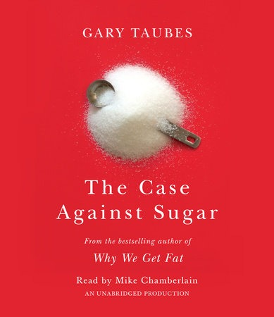

# The Case Against Sugar - Gary Taubes

## The Book In 3 Sentences

Sugar, a chronic toxin, directly causes insulin resistance and an elevated level of insulin resistance over time (dependent on genetic predisposition and other factors) causes an inexorable rise in a litany of chronic conditions such as diabetes, obesity, dementia, heart disease, hypertension and cancer to name a few. The sugar industry, a multibillion dollar industry, has fought tooth and nail to exonerate sugar as the cause of these aforementioned diseases and has shifted the blame on fat by vilifying it as the primary cause of chronic conditions. The ``Energy Balance`` tautology or a "calorie is a calorie" might be true thermodynamically however, a calorie of fat has a different metabolic and hormonal effect on our body than a calorie of sugar and therefore, isn't the most scientifically sound way to fight obesity.

## My 411

An eye-opening listen, this audiobook has changed the way I think about sugar and the sugar industry, a behemoth that has funded quack research to vilify fat and indiscriminately marketed and lobbied it's way into every meal. This book goes into extensive detail about the history of sugar from pre-industrial times through slavery, world wars and to modernity and how an ingredient primarily used in the highest echelons has entrenched itself in every strata of society in gargantuan amounts. Additionally, the casual relationship between sugar, insulin resistance and medically backed evidence of a host of chronic conditions is meticulously explored using the scientific method. Here are some facts that were the most revelatory:

1. Sugar is used in Alcoholics Anonymous' 12 step program as it is known to put the brain's pleasure system on overdrive many times more than heroin.
2. Sugar is used in the tobacco industry to make the smoke more acidic so that it can be inhaled more easily. 
3. According to research mentioned in the book Insulin resistance, not the over consumption of salt, causes chronic hypertension. 
4. Native American populations that were forced to modernize (consume more sugar in their diets and lead more sedentary lifestyles) the quickest, such as the case of the Pima tribe near Arizona, had the highest jump in the cases of these diseases in a short amount of time. 
5. Chronic diseases such as diabetes are inevitable with modern diets of high levels of sugar i.e. it's just a matter of when; some cohorts are genetically less susceptible than others, however, the end result is the same.
6. Alzheimer's is now being labeled as Type 3 diabetes as insulin resistance also causes plaque build up in the brain.

In the end, this book left me lying down in the fetal position breaking out in a cold sweat pontificating about all the times I decided to have dessert and the regret associated with my decisions in the past. After listening to the material, I have made an adjustment to my version of the weight loss equation: `Calories In << Calories Out && ~0 Sugar`.  I highly encourage everyone to go over this 11 and a half-hour audiobook!