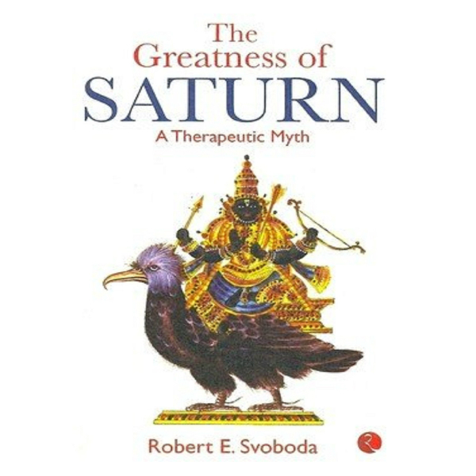

# The Greatness of Saturn - Robert Svoboda

## The Book in 3 Sentences
The symbols, or, as per Carl Jung, archetypes, we most acknowledge or identify with the most affect and control our lives and stories and myths are a way to keep these symbols alive. The universe is a combination of different frequencies that affect all of us differently and according to the Indian system of astrology, the planetary bodies closest to Earth (7 planets in our solar system barring Neptune and Pluto and the North and South lunar nodes) are the emitters of these different frequencies that have both benefic or malefic effects. Saturn in the ancient Indian system of astrology is considered to be the personification of that frequency that represents time, limitation, sorrows and all forms of adversity; Saturn makes us experience what's in store for us and this point is expanded upon through the story of a nobel and just king who goes through trials and tribulations during a harsh 7 and a half year period.

## My 411
Learning about the occult has always been something I have been interested in and this book delivered exactly what I was looking for - "rational" explanation to a seemingly irrational pseudo-science: Indian Astrology. The author of the book has written many of my favorite occult books and took his work to a whole new level with this book. 

His explanations of the different characteristics of planets and why it's important to acknowledge the existence of these frequencies is forcing function to continue reading. What was most interesting to me was the implicit symbology that's a part of all major religions of the world are a lot from astrological phenomenon because after all, all ancient civilizations had the sky in common and the syncretism of these astro-theological ideas is prime fodder for religious stories.

If there is one lesson from this book that's worth mentioning, it's that dispassionate submission to one's destiny if nothing else can be controlled is the easiest path forward. For those interested in getting a lucid introduction of Indian Astrology without the fluff or fraud, I highly recommend this book.

## Notes
1. The book is broken up into 4 following segments:
   1. An explanation of the purpose of therapeutic myth and how to use The Greatness Of Saturn.
   2. The main content of the book – King Vikram, a just and nobel king, deliberating in his court over which of the Nine Planets is superior and the verdict.
   3. A description of Saturn’s domination of King Vikram’s life for a seven and a half year period (known as Sade Sati in Hindu) and the important lessons he learned from this.
   4. Explanation of remedies and how they can be used to alleviate the ill effects of planetary influences.
2. The Greatness of Saturn teaches the reader to look at the limitations imposed by the planetary effects of Saturn in life as a way to grow spiritually. 
3. It is often easier to cast blame, rather than responsibility for our lives. Saturn imposes boundaries and limits that constrict. However it is up to individual to do what they need to do in order to deal with this and grow. 
4. One can begin to look at these obstacles in a new way – with respect and thanks for the move that Saturn provides us towards inner realms – towards greater endurance and humility.
5. Everyone is under Saturn’s control as he controls life destiny – if Saturn is happy, good fortune will appear in one’s life; if angry, he can destroy everything.