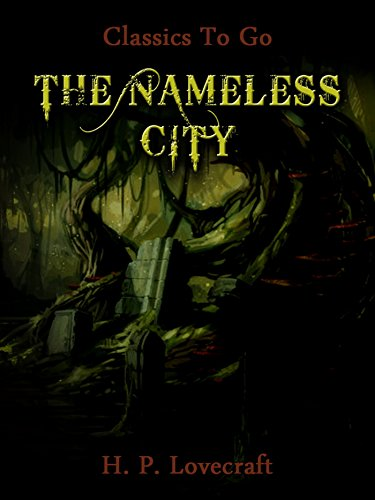

# The Nameless City - HP Lovecraft

## The Book In 3 Sentences

The unnamed narrator of the story goes into the middle of hte Arabian Peninsula to seek out and enter a lost city. After an initial inspection, the narrator comes back the following day and finds himself in a subterranean area filled with coffins and bizarre reptiles in them. He is left in a difficult situation after going down further and discovering more.

## My 411

Scared the hell out of me! Chills all the way through. Loved the build up - high recommend this book but be horror ahead!