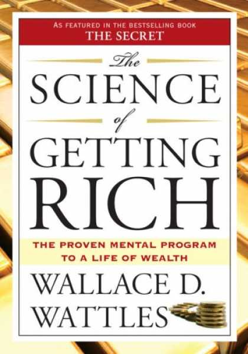

# The Science Of Getting Rich - Wallace D. Wattles

## The Book In 3 Sentences
There is a science of getting rich and sticking to the steps anyone, regardless of environment and background, can attain riches. Faith and purpose of your vision that's rooted deeply in a creative rather than a competitive mindset mixed with gratitude gets you rich. It's only by acting on your vision by doing every day all that can be done that day - taking care to do each act in a successful man­ner over a period of time is how richness is actualized.

## My 411
A quick read, "The Science Of Getting Rich" is one of the vanguards of the "you have to believe that you have it to get it" ideology. I personally liked the book as it is encouraging, optimistic and promulgates holding true to your vision and purpose without letting the things out of your control affect you. This is one of few unique books that is a cusp of spirituality and capitalism (one might think those ideologies are mutually exclusive) and that's what made this an interesting and out-of-the-ordinary read; the refreshing notion that "you don't have to give up all riches to be spiritual" is promoted throughout the book.

A critique one might hear is the dogmatic nature of the lessons where readers are required to reject a scientific attitude of disbelief and take every single lesson as truth.

My favorite part of the book is about the negatives of the competitive mindset and how one should adopt the creative mindset to become the best version of yourself and help others and yourself attain riches i.e. getting rich isn't a zero sum game.

The Secret, the popular book and documentary on Netflix, filched a majority of the ideas from this book. I prefer this book to the Secret as it provides extremely clear cut and structured advice rather than long winded descriptions. 

Overall, I would recommend this short but insightful book!

## Notes
1. There is a thinking stuff from which all things are made, and which, in its original state, permeates, penetrates, and fills the interspaces of the universe.
2. A thought in this substance produces the thing that is imagined by the thought.a
3. A person can form things in his thought, and by impressing his thought upon formless substance, can cause the thing he thinks about to be created.
   1. In order to do this, a person must pass from the __competitive__ to the __creative__ mind. Otherwise, he cannot be in harmony with the formless intelligence, which is always creative and never competitive in spirit.
4. Becoming the best version of yourself and getting rich is one of the few ways to help others become rich.
   1. To become the best version of yourself, you need to get rich as that's how you have the most amount of influence.
5. A person can come into full harmony with the formless substance by entertaining a lively and sincere sense of __gratitude__ for the blessings it bestows upon him.
   1. Gratitude unifies a person's mind with the think­ing mind so that an individual's thoughts are received by the formless substance. 
   2. A person can remain on the creative plane only by uniting himself with the formless intelligence through a deep and continuous feeling of gratitude.
6. An individual must form a __clear__ and __definite__ mental image of the things he wishes to have, do, or become. And, he must hold this mental image in his thoughts while being deeply grateful to the Supreme Power for granting him all of his desires. 
   1. The person who wishes to get rich must spend his leisure hours in contemplating­ his vision and in earnest thanksgiving that this reality is being given to him. 
   2. Too much stress cannot be laid on the importance of frequent contemplation of the mental image-coupled with unwavering faith and devout gratitude. This is the process by which the impression is given to the formless substance and the creative forces set in motion.
7. The creative energy works through the established channels of natural growth and through present industrial and social order. What he wants will come to him through the ways of established trade and commerce.
8. A person must be active in order to receive his own when it is ready to come to him. 
   1. He must more than fill his present place. 
   2. He must keep in mind the purpose is to get rich through realization of his mental image. 
   3. He must do every day all that can be done that day-taking care to do each act in a successful man­ ner. 
   4. He must give to every man a use value in excess of the cash value he receives-so that each transaction makes for more life. 
   5. He must hold the advancing thought so that the impression of increase will be com­municated to all with whom he comes in contact.
9.  The riches received will be in exact proportion to the definiteness of their vision, the fixity of their purpose, the steadiness of their faith, and the depth of their gratitude.