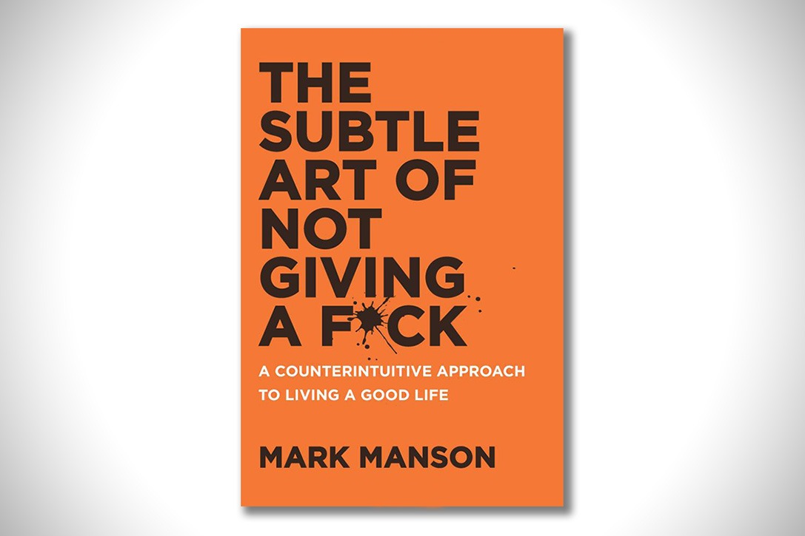

# The Subtle Art of Not Giving A F_ck -Mark Manson

## The Book In 3 Sentences
Reserve your f*cks for the things in life that align with your personal values and ignore the other things. Problems are inevitable and they never stop, however, it's a matter of paramount importance to decide which problems you choose to solve as true happiness is found in solving problems, not avoiding them. The only way to be comfortable with death is to understand and see yourself as something bigger than yourself, to contribute to some much larger entity.

## My 411
Loved the book! Extreme use of profanity (I didn't mind) didn't take away from the core message in each of the chapters. Picked up a plethora of lessons that were difficult to encapsulate in 3 sentences. I found a lot of parallels between the ideas presented in this book and Stoic philosophy, which made the read more familiar; a novice in  philosophical studies shouldn't find it challenging.