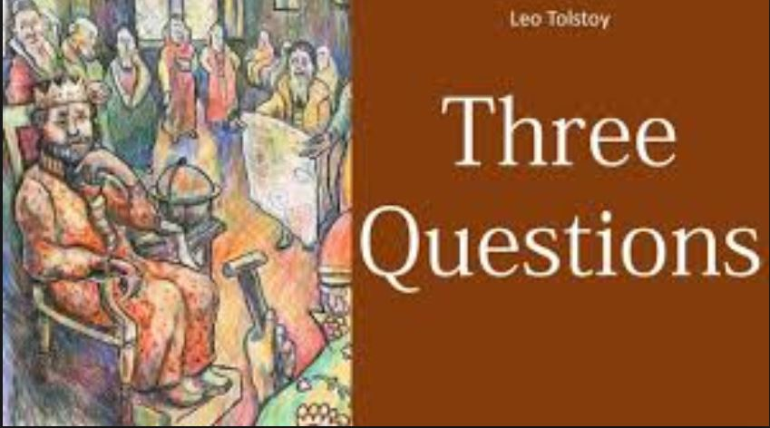

# Three Questions - Leo Tolstoy

## The Book In 3 Sentences

Leo Tolstoy explores the theme of wisdom, acceptance, kindness, and forgiveness. The story is about a king who wants to know the answer of the three questions so as to get enlightenment. The three questions/answers were:

| Question | Answer |
| ---------| --------| 
What was the right time for every action? | Now is the time to do every action because now is the only time that we have power. |
Who were the right people to be with?     |  The right person is who you are with. | 
What was the most important thing to do?  | The most important thing to do is to do good for the person you are with. | 

## My 411

Not much to say but a short story that does impart some wisdom on the reader. Better summarization can be found [here](https://smartenglishnotes.com/2020/10/04/the-three-questions-by-leo-tolstoy-summary-and-questions-and-answers/).