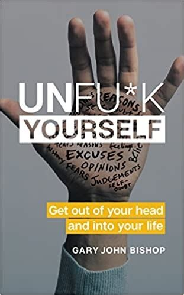

# Unfu_k Yourself - Gary John Bishop 

## The Book in 3 Sentences

The language you use with yourself makes a significant difference as it shapes your thoughts that eventually shape your reality and that reality should be devoid of unrealistic expectations as we should accept all that comes to us with full responsibility. We are not our thoughts, we are what we do - all successful people got where they did not because they let the demons of doubt get to them but because they overcame them and acted. Death is inevitable and your biggest deathbed regret will be that you didn't try, therefore, act relentlessly to achieve your goals and embrace uncertainty. 

## My 411

Finished another profanity ridden "self-help" book by Scottish author, Gary John Bishop that denounces the efficacy of traditional self-help books by bringing the reader / listener closer to reality. This book like 'The Subtle Art of Not Giving a F*ck' has a lot of lessons borrowed from Stoicism; multiple quotes from Epictetus, Socrates and Marcus Aurelius are generously sprinkled in. Each chapter barring the first and last introduces an affirmation the author prescribes to get you out of the rut of mundane existence and achieve your goals. By the end of the book, I was charged up enough to let out a "FREEDOM" ala Braveheart as I chugged down a bottle of Black Label (jk, I got the straight edge). Highly recommend this to anyone who want a modern dose of Stoic philosophy enmeshed with a non-conformist outlook on self-improvement. 